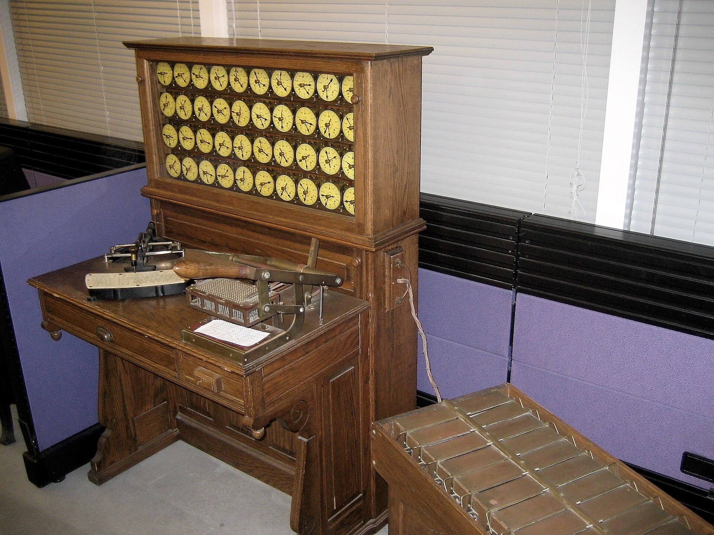

### Механічні обчислювальні машини

- **Машина Паскаля (1642 рік)** — створена Блезом Паскалем, ця механічна машина могла виконувати додавання та віднімання, полегшуючи обчислення податків і комерційний облік.

  

  

- **Різницева машина (1822 рік) та Аналітична машина** — розробки Чарльза Беббіджа, що мали на меті автоматизацію обчислення математичних таблиць. Аналітична машина, задумана в 1837 році, вважається прототипом сучасного комп'ютера, здатного програмуватися за допомогою перфокарт. 

  

  Різницеві машини:

  

  

  Аналітична машина

  

  

### Електромеханічні пристрої

- **Табулюючі машини Германа Голлеріта (1890 рік)** — використовувались для обробки даних перепису населення США, значно знижуючи час обробки. Це стало кроком до розвитку електронних обчислювальних систем.

