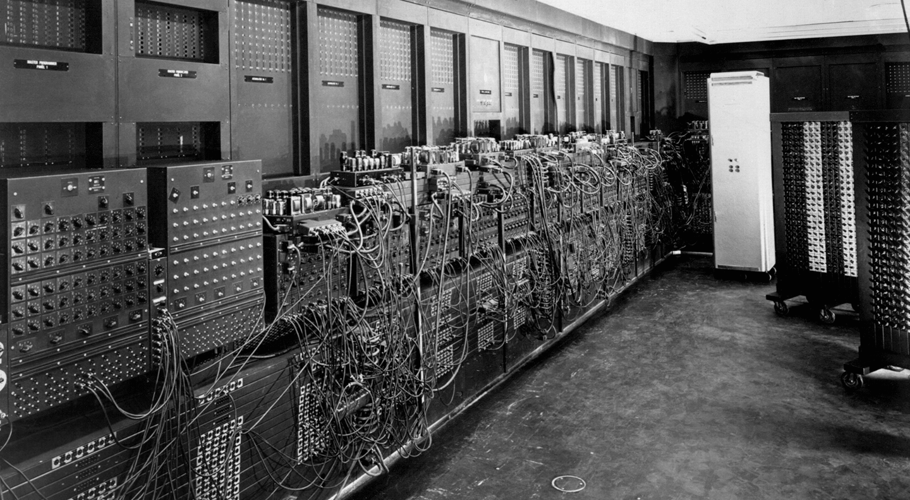

## Перехід від механічних до електронних машин

Перехід від механічних до електронних машин став однією з ключових віх у розвитку обчислювальної техніки. Кожен етап цього переходу відкрив нові можливості для збільшення швидкості, надійності, мініатюризації та доступності комп'ютерних технологій, покладаючи основу для створення сучасного цифрового світу.

### Електромеханічні реле

- **Раннє використання електромеханічних реле** (1930-ті роки) — електромеханічні реле стали одними з перших компонентів, що дозволяли створювати більш складні обчислювальні системи, здатні виконувати логічні операції та обробку даних.

  

  

### Вакуумні трубки

- **Розробка та впровадження вакуумних трубок** (1940-ті роки) — ця технологія дозволила значно збільшити швидкість обчислень порівняно з електромеханічними системами, а також зменшити розмір обчислювальних пристроїв. Вакуумні трубки стали основою для створення перших повноцінних електронних комп'ютерів, таких як ENIAC.

  

- **ENIAC (1946 рік)** — перший великий електронний обчислювальний машин, що знаменував собою еру електронних комп'ютерів. Він був розроблений для обчислення артилерійських таблиць для армії США та мав величезне значення для подальшого розвитку комп'ютерної техніки.

  

  

  

Табулятор від IBM (1947):

### Транзистори

- **Винахід транзистора** (1947 рік) — розробка транзистора вченими з Bell Labs відкрила нову еру в електроніці. Транзистори були меншими, надійнішими та ефективнішими за вакуумні трубки, що сприяло мініатюризації електронних пристроїв і стало ключовим фактором у розвитку персональних комп'ютерів. 

  

  

  Сучасний ЦП містить 50 млрд. транзисторів

  

### Інтегральні схеми

- **Розвиток інтегральних схем** (1950-ті – 1960-ті роки) — інтеграція великої кількості транзисторів та інших електронних компонентів в одному мікрочіпі значно збільшила потужність та ефективність комп'ютерів. Інтегральні схеми зробили можливим створення компактних, високопродуктивних і доступних комп'ютерних систем.

