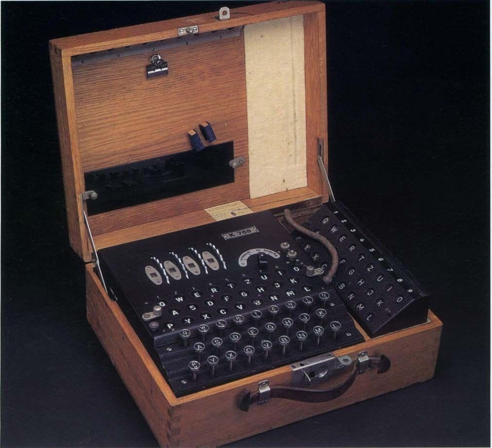
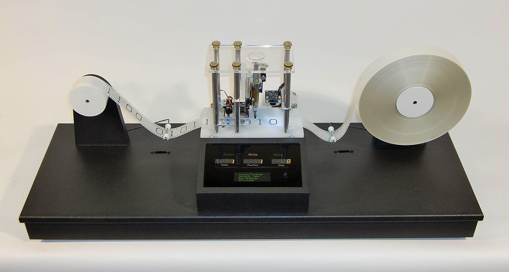
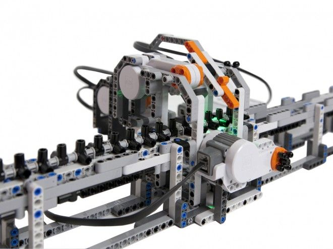

# Машина Тьюринга

Розвиток комп'ютерних технологій не можна уявити без згадки про теоретичний внесок Алана Тьюринга, який став основоположником сучасної комп'ютерної науки через свою концепцію машини Тьюринга.

## Концепція машини Тьюринга

- **Машина Тьюринга (1936 рік)**: Алан Тьюринг розробив абстрактну обчислювальну модель, відому як машина Тьюринга, яка стала фундаментальною для теорії обчислень. Ця модель складається з нескінченної стрічки, яка поділена на комірки (кожна з яких може містити символ з певного алфавіту), головки для читання та запису, яка може переміщуватися вліво чи вправо по стрічці, і набору правил (програми), які визначають, як машина реагує на кожен символ.

## Вплив на розвиток комп'ютерних технологій

- **Універсальна машина Тьюринга**: Тьюринг також розробив концепцію універсальної машини Тьюринга, яка може моделювати будь-яку іншу машину Тьюринга. Це поняття лягло в основу розвитку програмованих комп'ютерів, демонструючи, що машина може виконувати будь-яку обчислювальну задачу, якщо задача може бути описана як алгоритм.

## Тьюринг та його спадщина

- **Теоретична основа**: Машина Тьюринга довела, що для виконання будь-яких обчислень достатньо мати простий набір операцій, якщо є можливість їх виконувати послідовно та змінювати поведінку залежно від поточного стану. Це стало теоретичною основою для розробки алгоритмів та програмування сучасних комп'ютерів.
- **Визнання та нагороди**: Робота Тьюринга була визнана ключовим внеском у комп'ютерну науку, і в його честь було названо премію Тьюринга — найвищу нагороду в області комп'ютерних наук.

Машина Тьюринга ідеалізує поняття алгоритму та обчислення, надаючи міцний фундамент для розуміння того, як комп'ютери можуть виконувати програми та обробляти дані. Ця модель не лише сприяла розвитку теоретичної інформатики, але й забезпечила основу для створення програмованого комп'ютерного обладнання, яке ми використовуємо сьогодні.

Давайте розглянемо приклад машини Тьюринга, яка виконує просту задачу: перетворення кожної цифри "1" на "0" у послідовності, що складається лише з "0" та "1", і зупиняється, коли досягає першої пустої комірки.

### Приклад роботи машини Тьюринга

#### Алфавіт:

- {0, 1, ' '}, де ' ' — це символ пустої комірки.

#### Стрічка:

- Початкова стрічка може виглядати так: "1101 ".

#### Стани:

- S1 — початковий стан, в якому машина шукає цифру "1" для перетворення.
- S2 — кінцевий стан, коли машина досягає пустої комірки і зупиняється.

#### Правила (функції переходу):

1. Якщо в стані S1 і під головкою символ "1", то записати "0", перемістити головку вправо і залишитися в стані S1.
2. Якщо в стані S1 і під головкою символ "0", то не змінювати символ, перемістити головку вправо і залишитися в стані S1.
3. Якщо в стані S1 і під головкою символ ' ', то перемістити головку вправо і перейти в стан S2 (зупинка машини).

### Робота машини:

- Початкова стрічка: "1101 ".
- Крок 1: Головка читає "1", записує "0", переміщається вправо: "0101 ".
- Крок 2: Головка читає "1", записує "0", переміщається вправо: "0001 ".
- Крок 3: Головка читає "0", залишає "0", переміщається вправо: "0001 ".
- Крок 4: Головка читає "1", записує "0", переміщається вправо: "0000 ".
- Крок 5: Головка читає ' ', переходить в стан S2: машина зупиняється.

В результаті, всі "1" на стрічці були перетворені на "0", і машина зупинилася, досягнувши пустої комірки. Цей приклад демонструє базовий принцип роботи машини Тьюринга, який полягає у читанні символів, виконанні відповідних дій згідно з таблицею правил і переміщенні головки для обробки наступних символів.

[Online Turing Machine Simulator](https://turingmachinesimulator.com/)