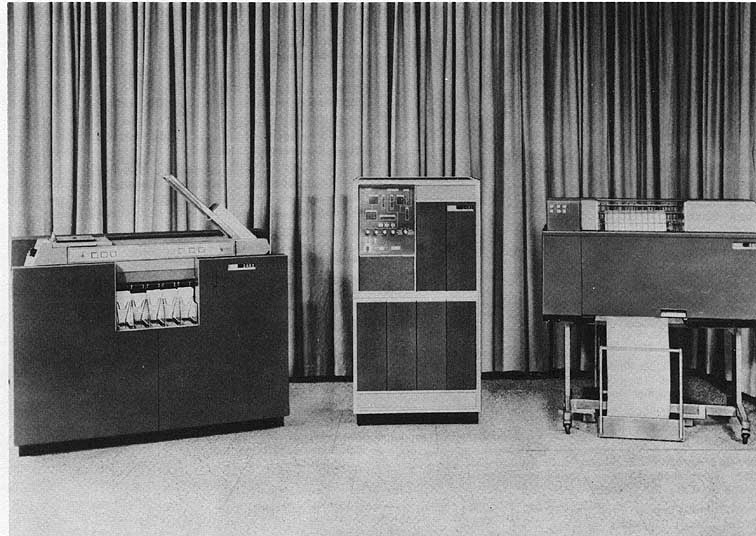
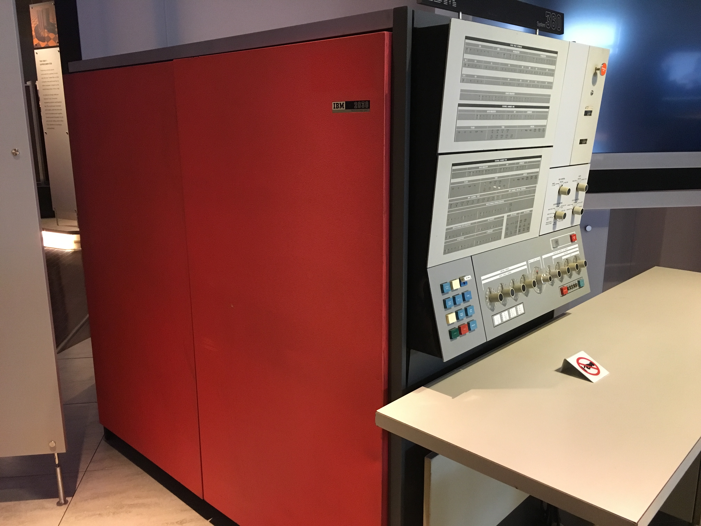
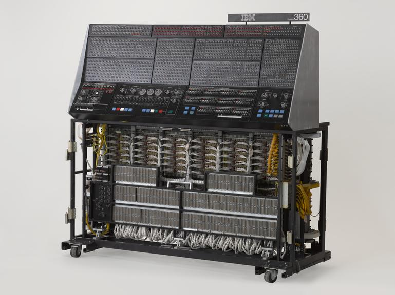
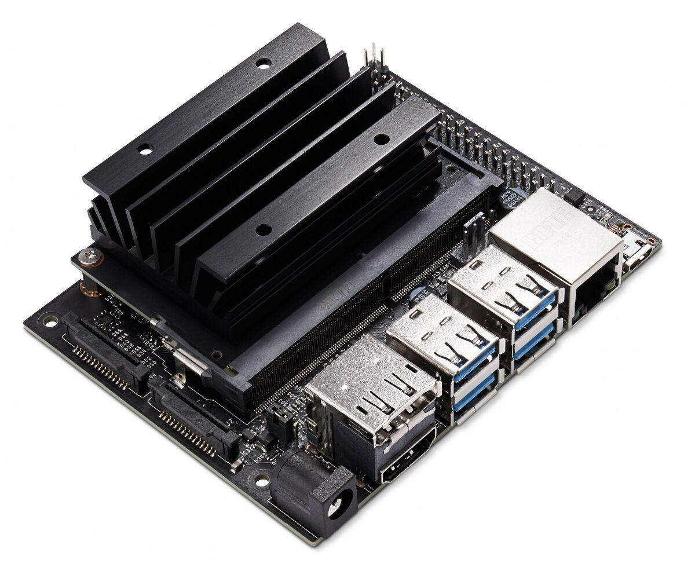
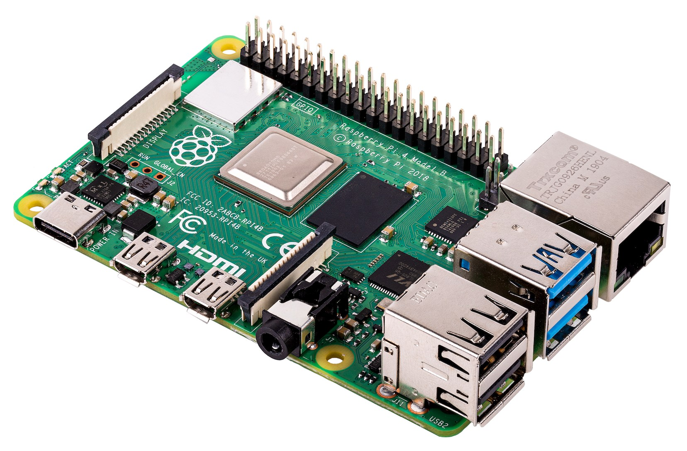
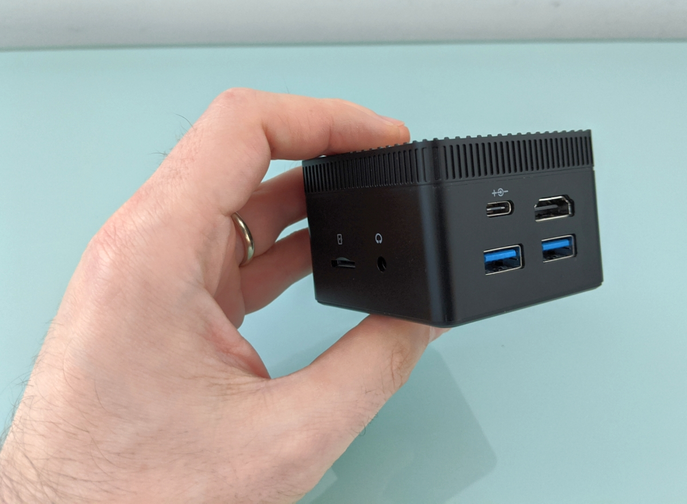
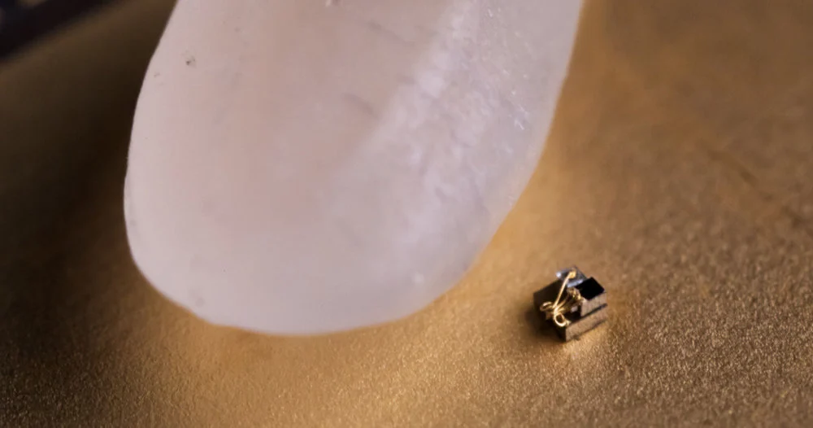

## Ключові етапи розвитку комп'ютерних технологій 

### Перше покоління (1940-1950-ті роки)

- **Вакуумні трубки** стали основою для комп'ютерів цього періоду. Перші комп'ютери, такі як ENIAC, використовували величезну кількість вакуумних трубок для обчислень і були досить об'ємними. Вони споживали багато енергії і виробляли велику кількість тепла.

  

### Друге покоління (1950-1960-ті роки)

- **Транзистори** замінили вакуумні трубки, що дозволило зробити комп'ютери меншими, надійнішими і ефективнішими. IBM 1401 є відомим прикладом комп'ютерів цього покоління.

  

  

### Третє покоління (1960-1970-ті роки)

- **Інтегральні схеми** почали використовуватися в комп'ютерах, значно підвищивши їх продуктивність і зменшивши розмір. Комп'ютери стають доступнішими для великих організацій. IBM System/360 є одним з найвідоміших комп'ютерів цього покоління.

  

  

- **Мікропроцесори** ввели еру персональних комп'ютерів. Завдяки мікропроцесорам, весь комп'ютер міг бути розміщений на одній платі, що зробило комп'ютери доступними для індивідуальних користувачів і малого бізнесу. Персональний комп'ютер IBM PC та Apple Macintosh є ключовими представниками цього покоління.

  

  

  
  
  

### П'яте покоління (1980-ті роки – до теперішнього часу)

- **Розвиток інтегрованих схем високої щільності** та **перехід до мікроелектроніки** дозволили створення потужних і енергоефективних комп'ютерів на одному мікрочіпі, відомих як мікропроцесори. Це сприяло масовому розповсюдженню персональних комп'ютерів, ноутбуків, смартфонів та інших мобільних пристроїв.
- **Прогрес у розвитку програмного забезпечення** включає поліпшення операційних систем, розробку використовуваних інтерфейсів і, звісно, інтенсивний розвиток областей, пов'язаних зі штучним інтелектом (ШІ) і машинним навчанням, які стають все більш важливими в багатьох аспектах сучасного життя – від аналітики даних до розумного дому.
- **Глобалізація та Інтернет** – стали не тільки засобом зв'язку між людьми, але й інтегрованою частиною повсякденного життя, де комп'ютерні технології використовуються у всьому: від соціальних мереж до інтернету речей (IoT).

### Шосте покоління (початок 21-го століття – до теперішнього часу)

* **Квантові комп'ютери** відкривають нові горизонти в обчислювальній техніці завдяки принципам квантової механіки. На відміну від класичних комп'ютерів, які використовують біти для представлення інформації як 0 або 1, квантові комп'ютери використовують квантові біти, або кубіти, що можуть представляти 0, 1 або обидва ці стани одночасно, дозволяючи виконувати обчислення неймовірно швидко для певних завдань. Це покоління ще знаходиться на ранніх етапах розвитку, але воно обіцяє революційні зміни у сфері криптографії, моделювання молекул для фармацевтики, оптимізації та інших областях, що вимагають величезної обчислювальної потужності. [Зображення: Квантовий комп'ютер].

Шосте покоління комп'ютерів, засноване на квантових технологіях, може кардинально змінити наше уявлення про обчислення, зробивши можливим розв'язання завдань, які наразі вважаються непідйомними для традиційних комп'ютерних систем. Хоча комерційне впровадження квантових комп'ютерів ще попереду, вже зараз очевидно, що вони мають потенціал створити нову еру в обчислювальній техніці.

