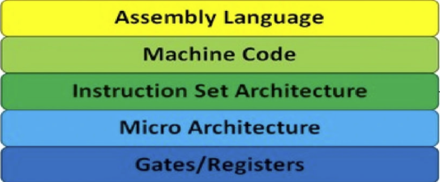

**Абстракція у комп'ютерних науках** - це метод виділення ключових характеристик об'єкта, ігноруючи незначні деталі. У контексті архітектури комп'ютерів, це дозволяє розробникам інтерфейсів, програмного забезпечення та апаратного забезпечення зосередитися на важливих аспектах системи, спрощуючи проектування та аналіз.

#### Огляд рівнів абстракції

1. **Рівень апаратного забезпечення (Hardware Level)**
   - Описує фізичні компоненти комп'ютера: процесори, пам'ять, пристрої вводe-виводу.
   - Включає деталі: електричні схеми, типи пам'яті, архітектура процесора.

2. **Рівень мікроархітектури (Microarchitecture Level)**
   - Визначає, як саме апаратне забезпечення виконує інструкції; включає реалізацію набору інструкцій.
   - Деталізує роботу кеш-пам'яті, пайплайнінг, а також інші оптимізації для покращення продуктивності.

3. **Рівень інструкційного набору (Instruction Set Architecture, ISA)**
   - Є мостом між апаратним та програмним забезпеченням, описує інструкції, які процесор може виконати, та як вони представляються у пам'яті.
   - Включає типи даних, реєстри, формати інструкцій, адресацію.

4. **Рівень операційної системи (Operating System Level)**
   - Представляє собою абстракції, необхідні для управління ресурсами обчислювальної системи, такими як пам'ять, процеси та операції вводу-виводу .
   - Включає концепції файлових систем, віртуальної пам'яті, багатозадачності.

5. **Рівень програмного забезпечення (Software Level)**
   - Включає аплікаційне програмне забезпечення та розробницькі інструменти, що використовуються для створення програм.

   - Забезпечує інтерфейси для взаємодії користувачів із комп'ютером і для розробки нових програм.

     

#### Комплексний огляд рівнів абстракції


На зображенні представлено схему рівнів абстракції в архітектурі комп'ютерів. Ця схема показує ієрархію від найнижчого рівня, який є найбільш фундаментальним і найменш абстрактним, до найвищого рівня, який є найбільш абстрактним і складним.

Від низу до верху рівні подані так:

1. **Physics (Фізика)** – найнижчий рівень, в основі якого лежать фізичні закони, що визначають роботу електронних компонентів.
2. **Devices (Transistors) (Пристрої (Транзистори))** – рівень, на якому транзистори використовуються для створення електронних пристроїв.
3. **Gates/Registers (Вентилі/Регістри)** – рівень, де транзистори об'єднуються в логічні вентилі та регістри, які є основою для виконання логічних операцій та зберігання інформації.
4. **Micro Architecture (Мікроархітектура)** – цей рівень описує, як логічні вентилі та регістри взаємодіють для реалізації мікроархітектури процесора.
5. **Instruction Set Architecture (Архітектура Набору Інструкцій)** – рівень, який визначає набір інструкцій, які можуть виконуватися процесором, та як вони представлені у машинному коді.
6. **Machine Code (Машинний Код)** – на цьому рівні програми, які були скомпільовані з вищих рівнів абстракції, представлені у формі, яку може безпосередньо виконувати апаратне забезпечення.
7. **Assembly Language (Мова Асемблера)** – рівень, де машинний код представлений у вигляді асемблерних інструкцій, більш зрозумілих для людини.
8. **Programming Language (Мова Програмування)** – вищий рівень мов програмування, який дозволяє розробникам писати програми в більш зрозумілій та абстрактній формі.
9. **Algorithm (Алгоритм)** – рівень, на якому описуються алгоритми, які можуть бути реалізовані на різних мовах програмування.
10. **Application (Додаток)** – найвищий рівень абстракції, що включає кінцеві програмні продукти, які використовують користувачі.

Ліворуч зображення є стрілка, яка вказує вгору та підписана "Increasing order of Complexity" (Збільшення складності) і "Increasing order of Abstraction" (Збільшення ступеня абстракції), підкреслюючи, що кожен наступний рівень є більш складним та абстрактним від попереднього. Праворуч зображення розділено на дві зони: "Hardware" (Апаратне забезпечення) для нижніх рівнів і "Software" (Програмне забезпечення) для верхніх.


## **Physics (Фізика)** 

Рівень фізики в контексті архітектури комп'ютерів — це основа всього, що пов'язане з комп'ютерами, починаючи від мікросхем та закінчуючи мережами зв'язку. На цьому рівні розглядаються фізичні закони та принципи, які дозволяють створювати компоненти апаратного забезпечення та здійснювати обчислення. Ось декілька ключових аспектів:

1. **Електроніка та напівпровідники:** Фундаментальні властивості матеріалів, таких як **кремній**, використовуються для створення транзисторів та інтегральних схем. Вивчення того, як електрони переміщаються через напівпровідники, дозволяє розробникам проектувати мікропроцесори та інші електронні компоненти.

   *Напівпровідники - це кристалічні речовини, такі як хімічні елементи, сполуки та сплави. Вони займають проміжне положення між провідниками (як метали) і діелектриками (як ізолятори) у здатності проводити електричний струм. У нормальних умовах напівпровідники або проводять невелику кількість струму, або взагалі не проводять. Однак при зростанні температури або під впливом світла вони починають краще пропускати електричні заряди. Також провідність напівпровідників може змінюватися при введенні домішок - цей процес називається "легування". Найвідоміший напівпровідник - **кремній** (Si). Сучасні напівпровідникові пристрої, як-от процесори та мікросхеми, використовуються повсюдно в нашому повсякденному житті: у смартфонах, комп'ютерах, телевізорах, автомобілях, медичній техніці, космічних супутниках і багато іншого.*

   

   

   

   *Кремній - це важливий матеріал у транзисторах, особливо в інтегральних мікросхемах. Давай розберемося простими словами:*

   1. *Транзистори - це електронні компоненти, які керують потоком електричного струму.*
   2. *Кремнієві транзистори використовують кремній як напівпровідник.*
   3. *Усередині транзистора є три шари:*
      1. *Емітер: Відправляє електрони.*
      2. *База: Управляє потоком електронів.*
      3. *Колектор: Приймає електрони.*
   4. *Коли на базу подається маленький сигнал, транзистор перемикається між провідним (1) і непровідним (0) станом.*
   5. *Це дає змогу посилювати сигнали і створювати складні логічні схеми.*

   

2. **Термодинаміка та управління теплом:** Комп'ютерні компоненти виробляють тепло під час роботи, і ефективне відведення цього тепла є критичним для підтримки працездатності системи. Принципи термодинаміки допомагають у розробці систем охолодження.

3. **Електромагнетизм:** Принципи електромагнетизму лежать в основі функціонування жорстких дисків, екранів, бездротових передавачів та інших компонентів комп'ютера.

4. **Фізика оптики:** Оптичні технології використовуються в широкому спектрі пристроїв, від оптоволоконних мереж до сенсорних екранів та оптичних дисків.

5. **Квантова механіка:** На нанорівні, де елементи схем стають все дрібнішими, квантові ефекти стають важливими для розуміння і прогнозування поведінки електронних компонентів.

На цьому рівні, розробники і інженери не мають справу з кодом або програмним забезпеченням, натомість вони займаються базовими компонентами, які роблять обчислення можливими. Фізика визначає обмеження та можливості для технологій, що використовуються у комп'ютерних системах, і є критично важливою для інновацій на більш високих рівнях абстракції.

*Кремній (від лат. silicon), але кремній != силікон*


## **Devices (Transistors) (Пристрої (Транзистори))**

Рівень пристроїв, особливо транзисторів, в архітектурі комп'ютерів є важливою ланкою, що перетворює фізичні принципи в функціональні елементи, які можна використовувати для побудови комп'ютерних систем. Ось докладніший огляд цього рівня:

1. **Транзистори як основні будівельні блоки:** Транзистори — це напівпровідникові пристрої, які можуть працювати як перемикачі або підсилювачі. У контексті комп'ютерів, транзистори найчастіше використовуються для виконання логічних операцій та зберігання даних. Вони є критичною частиною мікрочипів і схем, що використовуються в усьому від простих мікроконтролерів до складних ЦПУ.

   

   

2. **Інтегральні схеми:** Транзистори можуть бути об'єднані в інтегральні схеми (ІС), які містять сотні, тисячі, а то й мільйони транзисторів для створення більш складних функцій. ІС використовуються для створення різноманітних комп'ютерних компонентів, включаючи пам'ять, мікропроцесори та пристрої вводу-виводу.

3. **Мініатюризація та Мурів закон:** З часом інженери змогли значно зменшити розміри транзисторів, що дозволило підвищити щільність компонентів на мікрочипах і таким чином збільшити їхню обчислювальну потужність і ефективність. Мурів закон передбачав, що кількість транзисторів на ІС подвоюється приблизно кожні два роки, що довгий час було хорошим прогнозом для розвитку апаратного забезпечення.

4. **Кремнієва технологія та альтернативні матеріали:** Хоча більшість транзисторів традиційно виготовляють з кремнію, досліджуються й інші матеріали, як-от графен та органічні напівпровідники, які можуть забезпечити нові можливості для розвитку та оптимізації.

5. **Взаємодія з мікроархітектурою:** Транзистори формують логічні вентилі (гейти), які є основою для більш складних мікроархітектур. Логічні вентилі (гейти) виконують базові логічні операції (AND, OR, NOT), які комбінуються для створення більш складних схем, необхідних для архітектури комп'ютера.

6. **Важливість для інновацій:** Розвиток транзисторних технологій продовжує бути основою для інновацій в інформаційних технологіях. Вони забезпечують збільшення швидкості обчислень, зменшення енергоспоживання та підвищення загальної продуктивності систем.

Таким чином, рівень транзисторів утворює важливий фундамент, на якому будується вся архітектура комп'ютера, і він визначає обмеження та можливості, які будуть доступні на більш високих рівнях абстракції.


## Gates/Registers (Вентилі/Регістри)

На рівні вентилів та регістрів в архітектурі комп'ютерів, ми працюємо з елементами, що формують логічну структуру та пам'ять мікропроцесора.

### Логічні вентилі (Gates)

Логічні вентилі - це електронні пристрої, що виконують базові логічні функції і є фундаментом цифрової логіки. Кожен логічний вентиль використовує бінарну систему, де вхідні сигнали та вихід можуть мати лише два стани: високий (1) або низький (0), що відповідає істині або хибі в булевій логіці. Основні типи логічних вентилів:

- **AND (І)** - вихід активний, коли всі входи активні.
- **OR (АБО)** - вихід активний, якщо хоча б один вхід активний.
- **NOT (НЕ)** - інвертує вхідний сигнал.
- **NAND (І-НЕ)**, **NOR (АБО-НЕ)**, **XOR (Виключне АБО)** та інші, що є комбінаціями базових вентилів.

Логічні вентилі можна комбінувати для створення складніших логічних схем, таких як суматори, мультиплексори, декодери тощо.

### Регістри (Registers)

Регістри - це швидкодіючі сховища, які зберігають тимчасові дані, якими оперує процесор для виконання інструкцій. У високошвидкісних мікропроцесорах регістри виготовляються з транзисторів та є ключовою складовою системи управління та виконання команд.

Регістри можуть мати різноманітне призначення:

- **Акумулятори** - для проміжних результатів операцій.
- **Регістри зсуву** - для зсуву бітів вліво або вправо.
- **Регістри індексів** - для зберігання індексів масивів або покажчиків.
- **Регістри сегментів** - у архітектурі x86 використовуються для розділення пам'яті на сегменти.
- **Регістри статусу** (або флаги) - для зберігання статусу операцій, таких як переповнення, нуль, від'ємне значення та інше.

### Інтеграція в мікропроцесори

Логічні вентилі та регістри є основою мікроархітектури мікропроцесорів. Вони разом формують функціональні блоки, які реалізують архітектуру набору інструкцій (ISA), дозволяючи мікропроцесору виконувати складні обчислювальні задачі. Логічні вентилі комбінуються для створення арифметико-логічних одиниць (ALU), які можуть виконувати різні математичні операції та логічні порівняння. Регістри використовуються для швидкого доступу до необхідних даних під час виконання цих операцій.

Цей рівень є дуже важливим для розуміння, як працюють комп'ютери "під капотом", тому що саме тут формується основа для обробки даних та управління комп'ютерною системою.


## Micro Architecture (Мікроархітектура)

Мікроархітектура комп'ютера визначає, як саме реалізований набір інструкцій на фізичному рівні. Це є "проміжним" рівнем між фізичною структурою схеми на транзисторах та архітектурою набору інструкцій (ISA), яку програміст може використовувати на більш високому рівні.

Мікроархітектура включає в себе детальний опис таких компонентів:

1. **Контрольний блок (Control Unit):** Керує подачею інструкцій до різних частин процесора, виконує розшифровку команд та відповідає за синхронізацію операцій.

2. **Арифметико-логічний блок (Arithmetic Logic Unit, ALU):** Виконує математичні та логічні операції, такі як додавання, віднімання, і логічні порівняння.

3. **Регістри:** Швидкодіючі сховища для тимчасового зберігання даних і інструкцій, які використовуються в поточних обчисленнях.

4. **Кеш-пам'ять (Cache):** Пам'ять з малою затримкою доступу, яка зберігає копії даних з найчастіше використовуваних основних областей пам'яті для швидкого доступу.

5. **Шини (Buses):** Електричні доріжки, що забезпечують передачу даних між різними частинами процесора, а також між процесором і іншими компонентами комп'ютера.

6. **Пайплайнинг (Pipelining):** Техніка, яка дозволяє одночасно виконувати декілька інструкцій на різних стадіях обробки.

7. **Суперскалярність (Superscalar architecture):** Здатність процесора запускати декілька інструкцій одночасно, використовуючи декілька пайплайнів.

8. **Передбачення розгалужень (Branch Prediction):** Спроба здогадатись про напрямок розгалуження в програмі до того, як воно станеться, для збільшення ефективності пайплайнінга.

9. **Спекулятивне виконання (Speculative Execution):** Техніка, яка полягає в тому, що процесор розпочинає виконання інструкцій, які ще не були досягнуті в потоці команд, з метою підвищення продуктивності.

10. **Одноциклові виконання (Single-cycle execution):** Оптимізація, при якій інструкції виконуються за один такт годинника.

11. **Векторні операції (Vector Operations):** Використання спеціалізованих векторних регістрів та інструкцій для обробки декількох даних за один цикл, що корисно в наукових та графічних обчисленнях.


`Тут будуть окремі пояснення!`

Мікроархітектура варіюється від процесора до процесора, навіть якщо вони використовують одну й ту саму архітектуру набору інструкцій. Різні дизайни мікроархітектури забезпечують різні баланси між енергоспоживанням, продуктивністю, вартістю та іншими важливими характеристиками процесора. Розробка мікроархітектури — це складний процес, який вимагає глибокого розуміння як фізичних можливостей напівпровідникових технологій, так і вимог програмного забезпечення, яке буде на ньому виконуватися.


## Instruction Set Architecture (Архітектура Набору Інструкцій)

Архітектура набору інструкцій (Instruction Set Architecture, ISA) – це частина архітектури комп'ютера, яка пов'язана з програмуванням і включає набір інструкцій, які мікропроцесор може виконувати. ISA служить інтерфейсом між програмним забезпеченням та апаратним забезпеченням, дозволяючи програмному забезпеченню керувати апаратним забезпеченням за допомогою визначених команд.

### Основні компоненти ISA

1. **Інструкції:**
   - Основні команди, які процесор здатний виконувати. Вони включають арифметичні операції, операції над регістрами, управління пам'яттю, управління потоком виконання та вводо-вивід.
2. **Регістри:**
   - Набір невеликих, швидкодіючих сховищ у самому процесорі, які використовуються для швидкого доступу до даних та інструкцій під час виконання програм.
3. **Модель пам'яті:**
   - Визначає, як інструкції взаємодіють з пам'яттю, включаючи адресацію пам'яті, види доступу до пам'яті (читання, запис) та організацію пам'яті.
4. **Типи даних:**
   - Формати, в яких можуть бути представлені дані, такі як цілі числа, числа з плаваючою комою, бінарні дані тощо.
5. **Конвенції викликів:**
   - Правила для виклику та виконання функцій та процедур, включаючи передачу параметрів, роботу зі стеком та повернення результатів.

### Різновиди ISA

Архітектура набору інструкцій (ISA) є фундаментальною частиною процесора, оскільки вона визначає, які операції процесор може виконувати і як ці операції будуть представлені на мові машинних інструкцій. Вона є критично важливою для визначення інтерфейсу між програмним забезпеченням і апаратним забезпеченням.

ISA можна класифікувати за декількома характеристиками:

#### За Типом Архітектури

1. **CISC (Complex Instruction Set Computing):**
   - Інструкції мають різну довжину і можуть виконувати декілька низькорівневих операцій, таких як завантаження з пам'яті, арифметичну операцію і збереження результату назад у пам'ять, в одній інструкції.
2. **RISC (Reduced Instruction Set Computing):**
   - Інструкції зазвичай мають фіксовану довжину і тенденцію до спрощення, що дозволяє виконувати інструкції швидше і з меньшими затримками.
3. **VLIW (Very Long Instruction Word):**
   - Інструкції мають дуже довге слово, що дозволяє кодувати кілька операцій, які можуть бути виконані паралельно.
4. **EPIC (Explicitly Parallel Instruction Computing):**
   - Розвинута форма VLIW, зосереджена на підвищенні паралелізму на рівні інструкцій.
5. інші

#### За Способом Виконання Інструкцій

1. **Статичне назначення (Static Scheduling):**
   - Коли порядок виконання інструкцій визначається в момент компіляції програми.
2. **Динамічне назначення (Dynamic Scheduling):**
   - Процесор самостійно визначає порядок виконання інструкцій в залежності від доступності виконавчих одиниць і даних.
3. інші

#### За Методами Адресації

1. **Непряма адресація (Indirect Addressing):**
   - Використовує регістри або пам'ять для зберігання адреси, де розміщені дані.
2. **Пряма адресація (Direct Addressing):**
   - Адреса даних задана безпосередньо в інструкції.
3. **Реєстрова адресація (Register Addressing):**
   - Операція виконується безпосередньо з регістром.
4. **Непряма реєстрова адресація з індексацією (Indexed Addressing):**
   - Використовується значення регістра плюс офсет для визначення адреси пам'яті.
5. інші

#### За Роботою з Даними

1. **Стекові (Stack-based):**
   - Операції виконуються з вершиною стеку.
2. **Акумуляторні (Accumulator-based):**
   - Однорівнева система, де існує один особливий регістр (акумулятор) для результатів операцій.
3. **Регістрові (Register-based):**
   - Використовуються численні регістри замість або на додаток до стеку або акумулятора.
4. інші

#### За Рівнем Паралелізму

1. **SIMD (Single Instruction, Multiple Data):**
   - Одна інструкція працює одночасно з багатьма даними.
2. **MIMD (Multiple Instruction, Multiple Data):**
   - Декілька інструкцій можуть виконувати операції з різними наборами даних.
3. інші

#### За Роботою з Інструкціями

1. **Одноциклові інструкції (Single-cycle instructions):**
   - Кожна інструкція виконується за один цикл годинника.
2. **Багатоциклові інструкції (Multi-cycle instructions):**
   - Інструкції вимагають кілька циклів годинника для виконання.
3. інші

ISA - це складна і багатогранна концепція, що включає в себе не тільки набір інструкцій, але й велику кількість дизайнерських рішень, які впливають на загальну працездатність, ефективність та ринкову нішу процесорів. Кожна з цих класифікацій відіграє важливу роль в архітектурних рішеннях, які забезпечують баланс між сумісністю, продуктивністю, енергоспоживанням та виробничою вартістю.

### Значення ISA

Архітектура набору інструкцій є ключовим елементом у проектуванні комп'ютерних систем, оскільки вона визначає, як програмне забезпечення може взаємодіяти з апаратним забезпеченням. Хороше розуміння ISA необхідне для розробки ефективного програмного забезпечення, операційних систем і компіляторів, які оптимізують використання апаратних ресурсів. Також ISA є важливою для забезпечення сумісності програмного забезпечення між різними поколіннями апаратного забезпечення.


## **Machine Code (Машинний Код)**

Машинний код — це найнижчий рівень абстракції програмного коду, який може безпосередньо розуміти та виконувати апаратне забезпечення комп'ютера. Це набір інструкцій, закодованих у двійковій формі, які процесор використовує для виконання операцій. Кожна інструкція в машинному коді представляється унікальною послідовністю бітів, яку процесор може розпізнати та обробити.

### Компоненти Машинного Коду

1. **Опкод (Opcode):**
   - Частина інструкції, яка вказує процесору, яку операцію необхідно виконати (наприклад, додавання, віднімання, завантаження даних з пам'яті).

2. **Операнди:**
   - Частини інструкції, які вказують процесору, де знаходяться вхідні дані для операції, а також куди записувати результат. Операнди можуть вказувати на регістри процесора, адреси пам'яті, або вони можуть бути безпосередньо включені як значення в інструкцію.

### Властивості Машинного Коду

1. **Залежність від Апаратного Забезпечення:**
   - Машинний код прив'язаний до конкретної архітектури процесора. Інструкції для одного типу процесора не будуть працювати на іншому типі без спеціального емулятора або адаптера.

2. **Ефективність:**
   - Оскільки машинний код виконується напряму процесором, він є найбільш ефективним у термінах швидкості виконання, але його написання та зрозуміння є дуже складними.

3. **Низькорівневе програмування:**
   - Для взаємодії з машинним кодом програмісти зазвичай використовують асемблер, який дозволяє писати програми, використовуючи символьні імена інструкцій та адрес.

### Процес Виконання

1. **Фетч (Fetch):**
   - Процесор отримує інструкцію з пам'яті.

2. **Декодування (Decode):**
   - Процесор інтерпретує опкод і визначає, яку дію потрібно виконати.

3. **Виконання (Execute):**
   - Процесор виконує інструкцію з використанням одного або декількох операндів.

Машинний код — це, фактично, первинна мова комп'ютера. Незважаючи на те, що більшість сучасних програм пишуться на вищих рівнях абстракції з використанням мов програмування високого рівня, всі ці програми в кінцевому підсумку компілюються або інтерпретуються в машинний код, який здатний виконувати процесор.

Машинний код складається з послідовностей бітів, які безпосередньо вказують процесору, які операції виконувати. Ці послідовності бітів іноді відображаються у вигляді шістнадцяткових чисел для спрощення читання людьми.

Ось приклад простої машинної інструкції в шістнадцятковому представленні:

```
30 20 8F A3
```

Це може бути, наприклад, інструкція для процесора з архітектурою x86, де:

- `30` - опкод команди XOR, яка виконує операцію виключного "АБО" між двома операндами.
- `20` - може означати регістр, з якого буде прочитано перший операнд (наприклад, регістр `EAX`).
- `8F A3` - адреса в пам'яті, з якої буде прочитано другий операнд або до якої буде записаний результат.

Таке представлення залежить від конкретного процесора і його ISA, і конкретні значення опкодів та формат інструкцій можуть значно відрізнятися між різними архітектурами.

У реальності розробники зазвичай не працюють безпосередньо з машинним кодом; замість цього вони використовують асемблер, який дозволяє писати інструкції у більш читабельному текстовому форматі, який потім перетворюється в машинний код.

Приклад в асемблері:

```asm
XOR EAX, [0x8FA3]
```

Це високорівневе представлення однієї і тієї ж інструкції, яке буде перетворено в зазначений вище машинний код після асемблювання.


## **Assembly Language (Мова Асемблера)**

Мова асемблера є низькорівневою мовою програмування, яка тісно пов'язана з машинним кодом, але при цьому набагато зрозуміліша для людей. Вона дозволяє програмістам писати інструкції, які виконує процесор, використовуючи мнемонічні коди (скорочення або символи), які легше запам'ятовуються і розуміються людьми, ніж двійкові або шістнадцяткові представлення машинного коду.

### Ключові особливості мови асемблера:

1. **Тісна взаємодія з апаратним забезпеченням:**
   - Мова асемблера дозволяє безпосередньо взаємодіяти з регістрами процесора, пам'яттю та іншими апаратними засобами, що надає велику гнучкість і контроль над виконанням програм.

2. **Специфічність для архітектури:**
   - Кожна архітектура процесора має свою мову асемблера, що відображає її унікальний набір інструкцій та можливостей. Це означає, що код, написаний для одного типу процесора, зазвичай не може бути виконаний на іншому без змін.

3. **Висока ефективність:**
   - Програми, написані на мові асемблера, можуть бути дуже ефективними з точки зору швидкості виконання та використання пам'яті, оскільки програміст має можливість точно контролювати, які інструкції виконує процесор.

4. **Складність розробки та обслуговування:**
   - Написання та зрозуміння програм на мові асемблера вимагає глибоких знань архітектури процесора та машинного коду, що робить процес розробки та відлагодження складнішим, ніж при використанні мов вищого рівня.

### Приклад програми на мові асемблера:

Розглянемо простий приклад програми на мові асемблера для архітектури x86, яка складає два числа:

```assembly
section .text
    global _start

_start:
    mov eax, 5 ; Записуємо перше число в регістр EAX
    mov ebx, 10 ; Записуємо друге число в регістр EBX
    add eax, ebx ; Додаємо значення регістрів EAX та EBX, результат зберігається в EAX
    ; Тут може бути код для виводу результату
    mov eax, 1 ; Системний виклик для завершення програми
    int 0x80
```

Ця програма виконує додавання двох чисел (5 і 10) і зберігає результат у регістрі `eax`. Після виконання арифметичної операції програма завершується. В реальних програмах на асемблері може бути використано більше інструкцій для взаємодії з операційною системою, управління пам'яттю та виконання інших операцій.

Мова асемблера використовується в основному для розробки вбудованих систем, драйверів пристроїв, операційних систем та іншого програмного забезпечення, де потрібен прямий контроль над апаратними ресурсами або максимальна оптимізація.


## **Programming Language (Мова Програмування)**

Мови програмування — це формалізовані мовні конструкції, призначені для опису інструкцій, які може виконати комп'ютер. Вони дозволяють розробникам створювати програмне забезпечення через написання вихідного коду, який потім може бути перетворений у машинний код за допомогою компілятора або інтерпретатора, зробивши його зрозумілим для комп'ютера.

### Основні характеристики мов програмування:

1. **Абстракція:**
   - Мови програмування дозволяють абстрагуватися від деталей апаратного забезпечення, забезпечуючи рівні абстракції, які спрощують розробку програм.
2. **Синтаксис та семантика:**
   - Кожна мова має свій унікальний синтаксис — набір правил для структурування вихідного коду, та семантику — значення цих структур.
3. **Типізація:**
   - Мови можуть бути статично типізовані, де тип кожної змінної визначається на етапі компіляції, або динамічно типізовані, де типи змінних визначаються під час виконання програми.
4. **Парадигми програмування:**
   - Багато мов підтримують певні парадигми програмування, такі як об'єктно-орієнтоване, функціональне, процедурне або декларативне програмування, кожна з яких пропонує різні підходи до розв'язання задач.

### Приклади мов програмування:

1. **Python:**
   - Високорівнева, інтерпретована мова з динамічною типізацією, відома своєю читабельністю та гнучкістю. Широко використовується в наукових обчисленнях, веб-розробці та автоматизації.
2. **Java:**
   - Об'єктно-орієнтована мова програмування, яка компілюється в байт-код, виконуваний на Java Virtual Machine (JVM), що забезпечує високий рівень переносимості коду.
3. **C:**
   - Процедурна мова програмування, яка дозволяє ефективну роботу з пам'яттю та прямий доступ до апаратних ресурсів, широко використовується для розробки системного програмного забезпечення.
4. **JavaScript:**
   - Мова програмування високого рівня, яка первісно розроблялася для створення інтерактивних веб-сторінок. Зараз вона також використовується для серверної розробки (Node.js) та розробки мобільних додатків.

### Вибір мови програмування

Вибір мови програмування залежить від багатьох факторів, включаючи специфіку проекту, наявний досвід розробника, вимоги до продуктивності та доступні бібліотеки та фреймворки. Розуміння основних принципів і можливостей різних мов програмування дозволяє вибрати найбільш підходящий інструмент для кожного конкретного завдання.


## Приклад абстракції

Враховуючи, що машинний код дуже специфічний і залежить від архітектури процесора, а також враховуючи, що ми не можемо виконати реальний машинний код тут, наведемо приклад простої програми, яка додає два числа, в уявному представленні для машинного коду, у вигляді асемблера, C та Python.

#### Завдання: Додати два числа

Припустимо, нам потрібно додати числа 2 і 3.

#### Машинний код (уявний приклад для архітектури x86):
```
Біти: 10110010 00000010 00000000 (mov eax, 2)
Біти: 00000101 00000011 00000000 (add eax, 3)
```
Цей "машинний код" є вигаданим і призначений лише для ілюстрації. Реальний машинний код залежить від конкретної ISA.

#### Асемблер (для архітектури x86):
```assembly
mov eax, 2  ; Завантажує 2 у регістр EAX
add eax, 3  ; Додає 3 до значення в регістрі EAX
```

#### C:
```c
#include <stdio.h>

int main() {
    int a = 2;
    int b = 3;
    int sum = a + b;
    printf("Sum is: %d\n", sum);
    return 0;
}
```

#### Python:
```python
a = 2
b = 3
sum = a + b
print("Sum is:", sum)
```

Кожна з цих програм виконує однакове завдання — додає два числа та виводить результат. Однак рівень абстракції і зручність для програміста значно відрізняються. Python та C надають вищі рівні абстракції та більшу зручність порівняно з асемблером, а асемблер, в свою чергу, дає більше контролю над апаратним забезпеченням, ніж мови вищого рівня. Машинний код є найбільш низькорівневим і безпосередньо виконується процесором, але його важко читати та писати для людей.


## **Algorithm (Алгоритм)**

Алгоритм — це чітко визначена послідовність кроків або правил, призначених для виконання певного завдання або вирішення певної проблеми. Алгоритми є фундаментальними будівельними блоками комп'ютерних наук і програмування. Вони можуть бути реалізовані на будь-якій мові програмування і використовуються в широкому спектрі областей, від простого обчислення суми чисел до складних операцій, таких як обробка даних, машинне навчання та штучний інтелект.

### Основні характеристики алгоритмів:

1. **Визначеність:**
   - Кожен крок алгоритму має бути чітко визначений. Поведінка алгоритму повинна бути однозначною і не залежати від суб'єктивного інтерпретування.

2. **Вхідні дані:**
   - Алгоритм може мати нуль або більше вхідних даних, які він обробляє для отримання результату.

3. **Вихідні дані:**
   - Алгоритм має мати один або більше виходів, які є результатом обробки вхідних даних.

4. **Чіткість:**
   - Кожен крок алгоритму має бути настільки простим і чітким, щоб його могла виконати будь-яка виконавча одиниця, наприклад, комп'ютер.

5. **Кінцевість:**
   - Алгоритм повинен завершуватися за кінцеву кількість кроків, незалежно від вхідних даних.

6. **Ефективність:**
   - Алгоритм повинен бути ефективним з точки зору використання ресурсів, таких як час виконання та використання пам'яті.

### Приклад алгоритму: алгоритм сортування

Один з найпростіших алгоритмів сортування — сортування вибором. Його алгоритм можна описати так:

1. Найти у списку мінімальний елемент.
2. Обміняти місцями цей елемент з першим елементом списку.
3. Повторити кроки 1 і 2 для решти елементів списку, ігноруючи вже відсортовані.

Цей алгоритм легко розуміти та реалізувати, але він не є найефективнішим для великих наборів даних порівняно з більш складними алгоритмами сортування, такими як швидке сортування або сортування злиттям.

Алгоритми становлять основу для розробки програмного забезпечення, дозволяючи розробникам структурувати свої програми таким чином, щоб вони були зрозумілі, ефективні та легко підтримувані.


## **Application (Додаток)**

Додаток (або програмне забезпечення) — це комп'ютерна програма або набір програм, розроблених для виконання певних задач користувачем. Додатки можуть варіюватися від простих інструментів, як-от текстові редактори та калькулятори, до складних систем, таких як операційні системи, бази даних та платформи електронної комерції.

### Класифікація додатків

Додатки можна класифікувати за різними критеріями, включаючи їхнє призначення, платформу виконання та спосіб розповсюдження:

1. **За призначенням:**
   - **Офісні програми:** Текстові процесори, таблиці, програми для презентацій.
   - **Комунікаційні програми:** Електронна пошта, миттєві повідомлення, відеоконференції.
   - **Мультимедійні програми:** Плеєри, редактори аудіо та відео, графічні редактори.
   - **Ігри:** Від простих мобільних ігор до складних комп'ютерних ігор.
   - **Освітні програми:** Навчальні платформи, інтерактивні курси, словники.
   - **Утиліти:** Антивіруси, системи резервного копіювання, оптимізатори системи.

2. **За платформою:**
   - **Настільні додатки:** Програми, що встановлюються і виконуються на персональних комп'ютерах та ноутбуках.
   - **Мобільні додатки:** Програми для смартфонів і планшетів.
   - **Веб-додатки:** Програми, що доступні через веб-браузер без необхідності завантаження та встановлення.

3. **За способом розповсюдження:**
   - **Вільне ПЗ (Open Source):** Програмне забезпечення, код якого відкритий для перегляду, зміни та розповсюдження.
   - **Комерційне ПЗ:** Програмне забезпечення, розповсюджене на умовах ліцензії виробника з метою отримання прибутку.

### Особливості розробки додатків

Розробка програмного забезпечення вимагає глибоких знань у сфері програмування, а також розуміння потреб користувачів і бізнесу. Процес розробки зазвичай включає етапи планування, проектування, написання коду, тестування, випуск і підтримку. Важливим аспектом є вибір правильних технологій та інструментів, які дозволять створити ефективний та надійний продукт.

### Тенденції розвитку програмних додатків

- **Хмарні обчислення:** Перенесення додатків та даних у хмару для підвищення гнучкості та доступності.
- **Штучний інтелект та машинне навчання:** Інтеграція розумних алгоритмів для покращення функціональності та інтерактивності додатків.
- **Інтернет речей (IoT):** Розробка додатків, що взаємодіють з розумними пристроями в повсякденному житті.

Програмні додатки продовжують еволюціонувати, адаптуючись до нових технологій та змінюючихся потреб користувачів, відіграючи ключову роль у цифровій трансформації суспільства.


## Фокус курсу

#### Занадто високо:


#### Ідеально для курсу:



#### Занадто низько:


