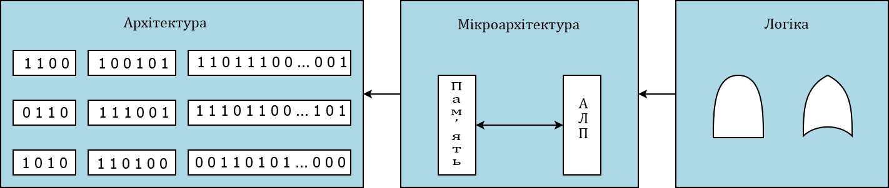
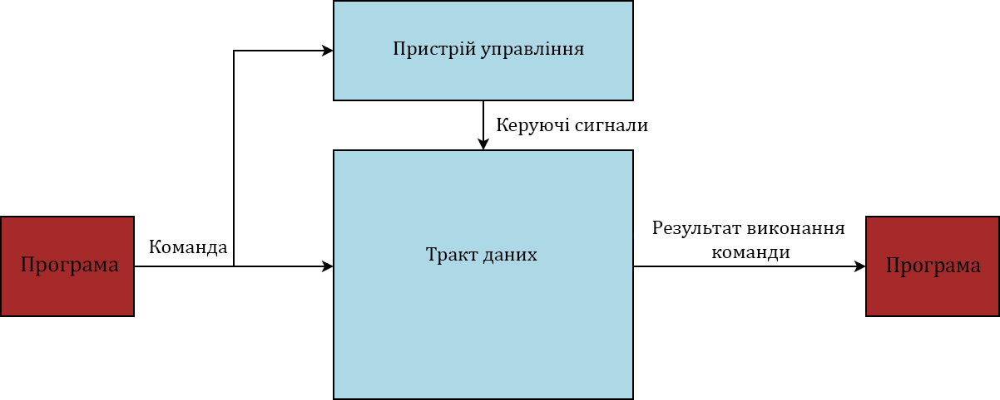
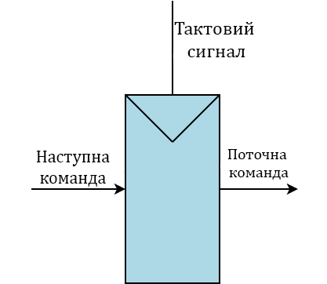
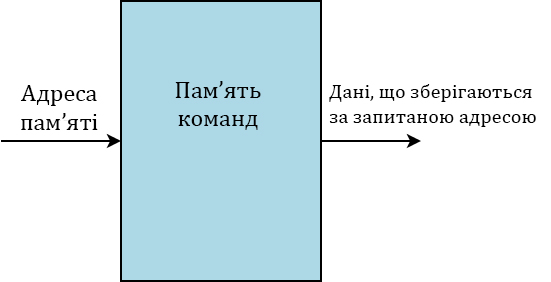
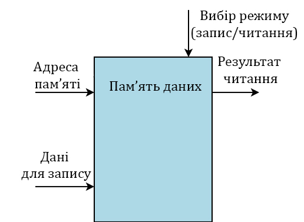
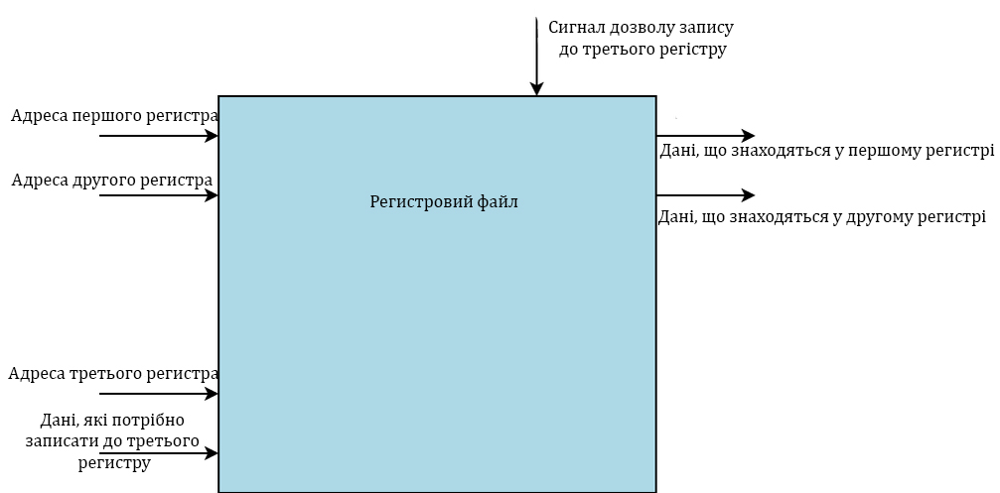

## Лекція №4: Вступ до мікроархітектури

Мікроархітектура є сполучною ланкою між логічними схемами та архітектурою. У межах нашої розповіді мікроархітектура - це наступний рівень складності. Вона описує, як саме в процесорі розташовані і з'єднані один з одним регістри, АЛП, схеми кінцевих станів, блоки пам'яті та багато іншого, необхідного для реалізації архітектури. 

У кожної архітектури, зокрема у багатьом відомої x86, може бути багато різних мікроархітектур, що забезпечують різне співвідношення продуктивності, ціни та складності. Усі вони зможуть виконувати одні й ті самі програми, але їхній внутрішній устрій може дуже сильно відрізнятися. У окремому випадку склад мікроархітектури визначається тим, який список команд передбачено для даного процесора. Але загалом, у будь-якій мікроархітектурі існує поділ на два блоки. 

**Тракт даних** - це частина мікроархітектури, яка містить у собі компоненти, що працюють над обробкою даних. Тракт даних отримує з пам'яті всі необхідні дані, здійснює над ними всі потрібні операції і зберігає це назад у пам'ять.

Сам тракт даних не знає, що саме потрібно зробити з даними, та й взагалі, він може не знати, чи можна йому перезаписувати дані в пам'яті. Визначенням типу операцій, дозволом запису даних тощо, займається пристрій управління - це другий блок мікроархітектури. 

Будь-яка мікроархітектура зобов'язана мати блоки зберігання. У найпростішому випадку ми матимемо: лічильник команд, регістровий файл і пам'ять. 

Лічильник команд є так званим зберігачем архітектурного стану системи. Тобто завдяки йому ми можемо на кожному етапі роботи мікропроцесора знати, чим він зайнятий. Сам лічильник команд постійно вказує на будь-яке місце в пам'яті команд. Та команда, на яку вказує лічильник, витягується процесором і виконується в тракті даних. Після її завершення значення лічильника змінюється залежно від того, як завершилася попередня команда. І так повторюється щоразу. За своєю будовою він являє собою звичайний регістр. 

Пам'ять команд потрібна для того, щоб зберігати команди, необхідні для виконання програм на цьому процесорі. Взагалі під командою ми розуміємо в буквальному сенсі інструкцію дій для процесора. Наприклад: ми можемо сказати процесору, щоб він узяв якісь два числа, що зберігаються в будь-якому місці в пам'яті, і склав їх, а результат записав у третє місце в пам'яті.

Пам'ять даних необхідна для того, щоб зберігати дані, з якими працюватиме програма в міру її виконання. Це якраз ті самі два числа, про які ми з вами говорили. 

Регістровий файл - це набір регістрів, які зберігають у собі дані, з якими працює процесор безпосередньо в момент виконання команди. У нашому прикладі, коли ми сказали процесору, які два числа ми хочемо скласти, він отримає їх із пам'яті та запише в цей регістровий файл. З нього він зможе максимально швидко попрацювати з ними. Але основна зручність цього блоку полягає в тому, що якщо наступній команді буде потрібен результат цього додавання, то процесор зможе не витрачати час на зворотний запис результату і повторне його вилучення, а просто залишити його в реєстровому файлі та дати доступ до цього регістру наступній команді. 

Ми розібрали всі блоки, які необхідні мікроархітектурі для зберігання. Як виконуючий пристрій використовуються АЛП. Усі ці компоненти з'єднуються безліччю різних способів за допомогою проміжних регістрів, мультиплексорів та іншого. 

### 1. Вступ

- Визначення мікроархітектури.
- Роль мікроархітектури у загальній архітектурі комп'ютера.
- Короткий історичний огляд розвитку мікроархітектури.

### 2. Основні компоненти мікроархітектури

- Гейти (логічні вентилі): основи логічних операцій, які виконують гейти.
- Регістри: призначення, типи, і як вони використовуються в мікроархітектурі.
- Архітектура набору інструкцій (ISA): зв'язок між мікроархітектурою і ISA.

### 3. Реалізація мікроархітектурних схем

- Як мікроархітектура перетворює інструкції ISA у фізичні операції.
- Приклади мікрооперацій: декодування інструкцій, виконання, доступ до пам'яті.
- Суперскалярні архітектури: паралельне виконання інструкцій.

### 4. Ключові аспекти оптимізації мікроархітектури

- Прогнозування розгалужень: методи та їх важливість.
- Пайплайнінг: як це підвищує продуктивність.
- Кешування та ієрархія пам'яті: роль кешів у зменшенні затримок доступу до пам'яті.

### Визначення мікроархітектури

Мікроархітектура — це набір фізичних і логічних елементів, що складають процесор комп'ютера, а також спосіб їхньої взаємодії для виконання інструкцій, заданих архітектурою набору інструкцій (ISA). Це включає логічні вентилі, регістри, буфери, алгоритми керування кеш-пам'яттю, управління пайплайнами та інші елементи, які разом визначають, як саме процесор виконує програмний код. Важливо зазначити, що мікроархітектура не однозначно визначена архітектурою набору інструкцій, адже різні мікроархітектури можуть реалізовувати одну й ту саму ISA, пропонуючи різні баланси продуктивності, енергоефективності та вартості.

### Роль мікроархітектури у загальній архітектурі комп'ютера

Мікроархітектура слугує сполучною ланкою між вищим рівнем абстракції, який представляє архітектуру набору інструкцій, та фізичною реалізацією цих інструкцій на апаратному рівні через логічні вентилі та інші елементи. Вона визначає, як комп'ютерна система виконує інструкції, тобто як вони декодуються, в якій послідовності обробляються, яким чином відбувається доступ до даних та їхнє зберігання. Отже, мікроархітектура безпосередньо впливає на продуктивність, енергоспоживання та загальну ефективність комп'ютерних систем.

### Короткий історичний огляд розвитку мікроархітектури

Розвиток мікроархітектури можна відстежити від перших днів комп'ютерної ери, коли ефективність та швидкодія були обмежені технологіями того часу.

- **Ранній період**: Перші мікропроцесори, такі як Intel 4004, впроваджували дуже прості мікроархітектури, які могли виконувати лише базові операції. Вони були обмежені кількістю транзисторів, які можна було інтегрувати на один чип, та їхньою швидкодією.

- **Еволюція пайплайнінгу**: З часом, однією з ключових інновацій стало введення пайплайнінгу, яке дозволило процесорам почати виконання наступної інструкції до завершення попередньої, значно збільшивши тим самим загальну продуктивність. Перші мікропроцесори з пайплайнінгом, такі як RISC-процесори від IBM і MIPS, демонстрували значні здобутки в оптимізації виконання програмного коду.

- **Суперскалярні архітектури**: Наступним великим кроком у розвитку мікроархітектури стало введення суперскалярних архітектур, які дозволили процесорам виконувати кілька інструкцій одночасно, завдяки декільком виконавчим блокам. Це стало можливим завдяки розвитку технологій виробництва, що дозволили розмістити більше транзисторів на мікрочипах.
- **Прогнозування розгалужень та ієрархія пам'яті**: Для подальшого збільшення продуктивності були розроблені технології прогнозування розгалужень, що дозволяли процесорам "вгадувати" шлях виконання програмних розгалужень та продовжувати виконання інструкцій без зупинки. Також, розвиток ієрархій пам'яті з кешами різних рівнів значно зменшив затримку доступу до даних.
- **Мультиядерні та багатопотокові архітектури**: У відповідь на обмеження подальшого збільшення тактової частоти через теплові та енергетичні обмеження, індустрія почала рухатися до мультиядерних і багатопотокових архітектур. Це дозволило паралельно обробляти більше інструкцій та даних, ще більше збільшуючи загальну продуктивність системи.
- **Технології зниження енергоспоживання та оптимізація для конкретних завдань**: Останнім часом особлива увага приділяється не лише продуктивності, але й енергоефективності мікропроцесорів, а також спеціалізованим архітектурам для конкретних завдань, таких як штучний інтелект і машинне навчання. Це включає розробку спеціалізованих процесорних блоків, як-от GPU, TPU та інших.

Кожен етап розвитку мікроархітектури сприяв збільшенню продуктивності, ефективності та можливостей комп'ютерних систем, дозволяючи їм виконувати дедалі більше завдань, від базових обчислень до складних алгоритмів штучного інтелекту та обробки великих даних.

- **Адаптація до нових викликів**: Останні роки принесли нові виклики, такі як забезпечення безпеки на рівні апаратного забезпечення від різноманітних видів атак, наприклад, Spectre і Meltdown. Це вимагає від мікроархітектури не лише забезпечення високої продуктивності та ефективності, але й високого рівня безпеки.
- **Еволюція мікроархітектурної технології**: Постійний прогрес у напівпровідниковій технології, такий як перехід на дедалі дрібніші техпроцеси, дозволяє розміщувати все більше транзисторів на одному чипі, що відкриває нові можливості для розробки складніших мікроархітектур з покращеною продуктивністю та енергоефективністю.
- **Інтеграція із іншими технологіями**: Сучасні мікроархітектури все більше інтегруються з іншими компонентами системи, такими як системи на кристалі (SoC), що об'єднують процесори, графічні адаптери, системи управління енергоспоживанням та інші необхідні блоки в одному мікрочипі. Це дозволяє створювати ще більш компактні, енергоефективні та потужні системи.
- **Фокус на спеціалізації та адаптивності**: Розвиток технологій штучного інтелекту та машинного навчання стимулює створення мікроархітектур, оптимізованих для цих конкретних завдань. Спеціалізовані мікроархітектури, такі як тензорні процесорні одиниці (TPU), пропонують значні переваги в продуктивності та ефективності для задач штучного інтелекту порівняно з традиційними процесорами.

### Гейти (логічні вентилі): основи логічних операцій, які виконують гейти

Логічні вентилі, або гейти, є основними будівельними блоками мікроархітектури, вони виконують елементарні логічні операції на двійкових даних. Ці операції включають І (AND), АБО (OR), НЕ (NOT), І-НЕ (NAND), АБО-НЕ (NOR), ВИКЛЮЧНО АБО (XOR), та ВИКЛЮЧНО АБО-НЕ (XNOR). Використовуючи лише ці базові операції, можна побудувати складніші логічні схеми, які виконують різноманітні функції в мікропроцесорах, від арифметичних операцій до контролю потоку даних.

### Регістри: призначення, типи, і як вони використовуються в мікроархітектурі

Регістри - це швидкодіючі сховища даних, що розміщені безпосередньо в процесорі. Вони забезпечують тимчасове зберігання даних та інструкцій, необхідних для виконання поточних операцій. Регістри можуть бути різних типів, включаючи загального призначення (для зберігання тимчасових даних і адрес), спеціалізовані (наприклад, регістр стану програми або регістр вказівника стеку), та регістри для зберігання конкретних значень (наприклад, плаваючої точки). Регістри дозволяють зменшити затримку при доступі до даних порівняно з використанням основної пам'яті, значно прискорюючи виконання програм.

### Архітектура набору інструкцій (ISA): зв'язок між мікроархітектурою і ISA

Архітектура набору інструкцій (ISA) визначає набір інструкцій, які процесор здатен розуміти і виконувати. ISA слугує як інтерфейс між програмним забезпеченням та апаратним забезпеченням, вказуючи, які операції може виконувати процесор, як форматуються інструкції, які типи даних вони можуть обробляти, і як ці інструкції взаємодіють з пам'яттю. Мікроархітектура, з іншого боку, визначає, як саме ISA реалізується на апаратному рівні. Різні мікроархітектури можуть реалізувати одну й ту саму ISA, пропонуючи різні підходи до оптимізації продуктивності, енергоспоживання та площі чіпа. Так, наприклад, два процесори з однаковою ISA можуть мати відмінності в реалізації пайплайну, управлінні пам'яттю, а також у способах виконання паралельних операцій, що призведе до різних характеристик продуктивності та ефективності.

ISA задає "що" має бути зроблено, тоді як мікроархітектура визначає "як" це буде зроблено. Це розрізнення є ключовим для розуміння, як програми, написані для певної архітектури, можуть виконуватися на різноманітному апаратному забезпеченні без необхідності змінювати сам код. Ця сумісність важлива для розробників програмного забезпечення, оскільки вона дозволяє створювати програми, які працюватимуть на широкому спектрі обладнання, що підтримує дану ISA.

### Як мікроархітектура перетворює інструкції ISA у фізичні операції

Мікроархітектура перетворює інструкції, визначені в архітектурі набору інструкцій (ISA), на конкретні фізичні або електронні дії, які виконуються апаратним забезпеченням процесора. Цей процес включає кілька кроків:

1. **Зчитування інструкції**: Процесор зчитує інструкцію з пам'яті.
2. **Декодування інструкції**: Декодер інструкцій аналізує інструкцію та перетворює її на одну або декілька мікрооперацій, які визначають, які саме дії потрібно виконати.
3. **Виконання мікрооперацій**: Виконавчі одиниці процесора обробляють мікрооперації, використовуючи регістри для зберігання проміжних даних та виконуючи арифметичні, логічні, та інші операції.
4. **Доступ до пам'яті**: Якщо потрібно, виконуються операції зчитування або запису в пам'ять.
5. **Завершення інструкції**: Результати операцій можуть бути записані назад в регістри або пам'ять, і процесор переходить до наступної інструкції.

### Приклади мікрооперацій: декодування інструкцій, виконання, доступ до пам'яті

- **Декодування інструкцій**: Процес перетворення інструкцій ISA у внутрішні команди, розумілі процесором. Наприклад, інструкція ISA для додавання двох чисел перетворюється на мікрооперації, які зчитують значення з регістрів, виконують додавання та записують результат назад у регістр.
- **Виконання**: Фактичне виконання арифметичних або логічних операцій. Наприклад, мікрооперація, яка виконує арифметичне додавання двох значень з регістрів.
- **Доступ до пам'яті**: Операції зчитування або запису в пам'ять, які забезпечують перенесення даних між пам'яттю та регістрами процесора. Наприклад, мікрооперація зчитування даних з конкретної адреси пам'яті для використання в наступній арифметичній операції.

### Суперскалярні архітектури: паралельне виконання інструкцій

Суперскалярні архітектури представляють собою клас процесорних архітектур, здатних виконувати декілька інструкцій одночасно за один такт процесора. Ця здатність до паралельного виконання досягається за рахунок наявності кількох виконавчих блоків у процесорі, які можуть обробляти інструкції незалежно одна від одної. Основні аспекти суперскалярних архітектур включають:

- **Декодування інструкцій**: Суперскалярні процесори мають декодери, здатні одночасно обробляти декілька інструкцій. Це вимагає складної логіки для визначення залежностей між інструкціями та для того, щоб вирішити, які інструкції можна безпечно виконувати паралельно.
- **Виконавчі блоки**: У суперскалярних архітектурах існує кілька незалежних виконавчих блоків, кожен з яких може виконувати певний тип інструкцій (наприклад, арифметичні операції, операції з плаваючою точкою, логічні операції тощо). Це дозволяє процесору виконувати кілька інструкцій одночасно.
- **Пайплайнінг**: Суперскалярні процесори використовують пайплайнінг для подальшого підвищення продуктивності. Пайплайнінг дозволяє розділити процес виконання інструкцій на кілька стадій, кожна з яких може виконуватися в паралелі з іншими стадіями для інших інструкцій. Це означає, що в будь-який момент часу кілька інструкцій можуть знаходитися на різних стадіях виконання в межах пайплайну.
- **Динамічне планування**: Багато сучасних суперскалярних архітектур використовують динамічне планування виконання інструкцій, що дозволяє процесору в реальному часі визначати порядок виконання інструкцій залежно від наявності даних та ресурсів. Це допомагає зменшити затримки, пов'язані з очікуванням на залежні дані, і підвищує загальну продуктивність.

### Прогнозування розгалужень: методи та їх важливість

Прогнозування розгалужень — це техніка, використовувана в мікроархітектурі процесорів для зменшення затримок, пов'язаних з виконанням умовних інструкцій (розгалужень). Умовні розгалуження в програмах створюють невизначеність щодо того, який шматок коду буде виконано далі, до моменту вирішення умови, що призводить до потенційних затримок у пайплайнах. Методи прогнозування включають:

- **Статичне прогнозування**, яке завжди передбачає, що розгалуження буде виконано або не виконано, в залежності від простої евристики, яка не змінюється під час виконання програми.
- **Динамічне прогнозування** використовує історію виконання розгалужень для прогнозування майбутніх рішень розгалуження. Це може включати прості двобітні адаптивні автомати для кожного розгалуження або складніші методи, які враховують глобальну історію розгалужень.

Важливість прогнозування розгалужень полягає у тому, що воно дозволяє пайплайну продовжувати виконання інструкцій без очікування вирішення умови розгалуження, тим самим збільшуючи продуктивність.

### Пайплайнінг: як це підвищує продуктивність

Пайплайнінг — це техніка, при якій інструкція розділяється на кілька етапів, кожен з яких виконується в окремому блоку пайплайна. Це дозволяє процесору працювати над декількома інструкціями одночасно, але на різних стадіях їх виконання, подібно до лінії збірки в виробництві. Етапи можуть включати зчитування інструкції, декодування, виконання, доступ до пам'яті та запис результату. Пайплайнінг підвищує продуктивність, зменшуючи час очікування між виконаннями інструкцій та дозволяючи більш ефективне використання ресурсів процесора.

### Кешування та ієрархія пам'яті: роль кешів у зменшенні затримок доступу до пам'яті

Кешування та ієрархія пам'яті — це техніки, спрямовані на оптимізацію швидкості доступу до даних, які процесор використовує під час виконання програм. Оскільки доступ до основної пам'яті (RAM) є відносно повільним процесом, кеш-пам'ять, яка є швидшою, але меншою за обсягом, використовується для зберігання часто використовуваних або нещодавно використаних даних.

- **Кеш-пам'ять**: Кеш поділяється на декілька рівнів (L1, L2, іноді L3 і більше), де L1 є найшвидшим і найменшим за обсягом, а кожен наступний рівень є повільнішим і більшим. Кеш-пам'ять зменшує затримки, ефективно "проміжно" зберігаючи дані між швидким процесором та відносно повільною основною пам'яттю.
- **Ієрархія пам'яті**: Це концепція організації сховищ даних у вигляді ієрархії, де кожен наступний рівень є повільнішим і більшим за попередній. Ієрархія пам'яті дозволяє оптимізувати вартість і продуктивність системи, надаючи швидкий доступ до найбільш часто використовуваних даних, в той час як менш часто використовувані дані зберігаються на повільніших, але дешевших носіях.

Роль кешів у зменшенні затримок доступу до пам'яті є критичною для загальної продуктивності комп'ютера. Кеш-пам'ять використовує алгоритми, такі як LRU (Least Recently Used) або FIFO (First In, First Out), для визначення, які дані будуть зберігатися в кеші. Це дозволяє процесору швидше отримувати доступ до необхідних даних, зменшуючи затримки та покращуючи загальну продуктивність системи.

Усі ці техніки — прогнозування розгалужень, пайплайнінг, кешування та ієрархія пам'яті — разом формують основу сучасної мікроархітектури, спрямовану на мінімізацію затримок і оптимізацію швидкодії процесора.

Основні мікроархітектури, які визначали розвиток і тренди в області процесорних технологій протягом останніх декількох десятиліть, включають як старіші, так і сучасні дизайни. Ось декілька визначних прикладів:

### Intel

- **P6**: Впроваджена в середині 90-х, P6 була мікроархітектурою Pentium Pro, Pentium II, і Pentium III процесорів.
- **NetBurst**: Архітектура, що лежить в основі Pentium 4 процесорів. Відома своїм дуже високим тактовим частотам, але і високим споживанням енергії.
- **Core**: Сімейство мікроархітектур, починаючи з Core 2, що відзначились значно кращою продуктивністю та енергоефективністю.
- **Nehalem**, **Sandy Bridge**, **Ivy Bridge**, **Haswell**, **Broadwell**, **Skylake**, **Kaby Lake**, **Coffee Lake**, **Comet Lake**, **Ice Lake**, **Tiger Lake**, **Alder Lake**: Послідовність мікроархітектур, які пропонували поступові покращення в продуктивності, енергоефективності, та інтегрованих графічних можливостях.

### AMD

- **K7**: Мікроархітектура процесорів Athlon, яка була прямим конкурентом Intel Pentium III.
- **K8**: Включає в себе процесори Athlon 64, перші в індустрії з підтримкою 64-бітних інструкцій.
- **Bulldozer**: Відома своєю модульною конструкцією, пропонувала непогані мульти-тредові можливості, але мала змішані відгуки щодо продуктивності.
- **Zen**, **Zen 2**, **Zen 3**, **Zen 4**: Сучасна серія мікроархітектур, яка знову встановила AMD як конкурента Intel на ринку процесорів завдяки високій продуктивності та ефективності.

### ARM

- **Cortex**: Серія мікроархітектур для широкого спектра застосувань, від мобільних пристроїв до серверів. Включає Cortex-A, Cortex-R, і Cortex-M серії для різних ринків.
- **Neoverse**: Спрямована на інфраструктуру та серверні рішення, Neoverse мікроархітектура покликана задовольнити потреби в обчислювальній потужності в центрах обробки даних і мережевому обладнанні.

Алгоритми в мікроархітектурах — це набори інструкцій або правил, що визначають, як саме процесор виконує операції, обробляє дані та управляє потоками інформації всередині себе. Ці алгоритми оптимізують продуктивність, енергоефективність та загальну ефективність процесора. Ось декілька ключових алгоритмів, що використовуються в мікроархітектурах:

### Прогнозування розгалужень (Branch Prediction)

Прогнозування розгалужень дозволяє процесору передбачати, який шлях виконання програми буде обраний у випадку умовного розгалуження (наприклад, в if-else структурах). Це дозволяє процесору завчасно завантажувати інструкції, що зменшує затримки, пов'язані з очікуванням вирішення умови розгалуження.

### Пайплайнінг (Pipelining)

Пайплайнінг — це техніка, яка розділяє процес виконання інструкцій на декілька послідовних етапів, дозволяючи одночасно виконувати різні етапи різних інструкцій. Це підвищує загальну продуктивність процесора, дозволяючи новій інструкції починатися до завершення попередньої.

### Out-of-Order виконання (Out-of-Order Execution)

Out-of-Order виконання дозволяє процесору виконувати інструкції не за порядком їх надходження, а залежно від доступності вхідних даних і виконавчих ресурсів. Це допомагає мінімізувати час простою, чекаючи на завершення попередніх інструкцій або звільнення ресурсів.

### Суперскалярність (Superscalar Execution)

Суперскалярність дозволяє процесору виконувати декілька інструкцій одночасно завдяки наявності кількох виконавчих одиниць. Це суттєво підвищує пропускну здатність і продуктивність процесора.

### Кешування (Caching)

Алгоритми кешування визначають, які дані або інструкції зберігатимуться у кеш-пам'яті для швидкого доступу. Сучасні процесори використовують складні алгоритми для визначення, які дані слід кешувати, засновуючись на частоті використання та інших евристиках.

### Керування потоком даних (Data Flow Management)

Керування потоком даних організовує ефективне переміщення даних всередині процесора між регістрами, кешем та основною пам'яттю. Це включає алгоритми для оптимізації звернень до пам'яті, зменшення затримок і максимізації пропускної здатності даних.

### Паралелізм на рівні даних (Data-Level Parallelism, DLP)

DLP використовує векторні або SIMD (Single Instruction, Multiple Data) алгоритми для одночасного виконання однакових операцій над кількома наборами даних. Це особливо ефективно для завдань, які вимагають обробки великих масивів даних, наприклад, в графіці або обробці сигналів.

### Спекулятивне виконання (Speculative Execution)

Спекулятивне виконання - це процес, у якому процесор виконує інструкції, які, як передбачається, можуть бути потрібними в майбутньому, перш ніж буде відомо, чи дійсно ці інструкції потрібні. Це допомагає заповнити потенційні затримки в пайплайні, але також вимагає додаткових ресурсів для управління спекулятивно виконаними інструкціями.

### Перемикання контекстів (Context Switching)

Перемикання контекстів – це процес збереження стану поточного завдання, щоб процесор міг перейти до виконання іншого завдання, а потім повернутися і відновити виконання оригінального завдання з місця зупинки. Ефективні алгоритми перемикання контекстів важливі для операційних систем і мультизадачності.

### Менеджмент енергоспоживання (Power Management)

Алгоритми менеджменту енергоспоживання оптимізують використання енергії процесором, автоматично регулюючи тактову частоту та напругу в залежності від поточного навантаження. Це дозволяє зменшити споживання енергії та випромінювання тепла при невеликих завданнях, зберігаючи ресурси для більш вимогливих процесів.

Кожен з цих алгоритмів відіграє ключову роль у забезпеченні високої продуктивності, ефективності та адаптивності сучасних мікроархітектур. Вони дозволяють процесорам ефективно справлятися з широким спектром обчислювальних завдань.

Кеш-пам'ять — це швидкодійна проміжна пам'ять, яка використовується в процесорах для зменшення середнього часу доступу до даних. Кеш прискорює роботу комп'ютера, зберігаючи копії даних з найчастіше використовуваних основних адрес пам'яті. Ось основні аспекти кешування, які допомагають зрозуміти його роль і функціонування у мікроархітектурі процесора:

### Рівні кешу

- **L1 (Level 1)**: Це найшвидша кеш-пам'ять, яка знаходиться безпосередньо на мікропроцесорі. Через свою швидкість та розташування, вона має невеликий обсяг. L1 кеш зазвичай поділяється на кеші для даних та інструкцій.
- **L2 (Level 2)**: L2 кеш є повільнішим за L1, але має більший обсяг. Він може бути інтегрованим безпосередньо в мікропроцесор або розташованим на окремому чипі, що все одно знаходиться поряд з процесором.
- **L3 (Level 3)**: Цей рівень кешу є ще повільнішим, але його обсяг значно більший, ніж у L1 та L2. L3 часто використовується для спільного доступу між декількома процесорними ядрами.

### Робота кешу

Процесор використовує стратегію "кешування", щоб зменшити кількість звернень до повільнішої основної пам'яті. Коли процесор потребує доступу до даних:

1. **Перевірка L1 кешу**: Спочатку перевіряється, чи знаходяться потрібні дані в L1 кеші.
2. **Перевірка L2 кешу**: Якщо дані не знайдені в L1, процесор перевіряє L2 кеш.
3. **Перевірка L3 кешу**: Якщо дані відсутні й в L2, виконується звернення до L3 кешу, якщо такий існує.
4. **Звернення до основної пам'яті**: Якщо дані не знайдені ні в одному з рівнів кешу, процесор звертається до основної пам'яті.

### Алгоритми заміщення

Коли кеш-пам'ять заповнюється, виникає потреба в заміщенні деяких даних новими. Для цього використовуються різні алгоритми заміщення, такі як:

- **LRU (Least Recently Used)**: Видаляє дані, які використовувалися найменш нещодав

- но, на основі припущення, що дані, які були використані в минулому, мають більше шансів бути використаними знову.

  - **FIFO (First In, First Out)**: Видаляє дані в порядку їхнього додавання, незалежно від частоти або часу останнього використання.
  - **Random**: Випадковим чином вибирає, які дані будуть видалені для звільнення місця для нових даних.

  ### Асоціативність кешу

  Асоціативність кешу визначає, як дані розміщуються в кеші. Існують різні типи асоціативності:

  - **Пряма асоціативність**: Кожен блок даних у пам'яті мапується на конкретне місце в кеші. Хоча цей метод є простим і швидким, він може призводити до конфліктів і неефективного використання кешу.
  - **Повна асоціативність**: Будь-який блок даних може бути збережений у будь-якому місці кешу. Це зменшує конфлікти, але вимагає більше часу та обчислювальних ресурсів для пошуку даних.
  - **N-шляхова набірно-асоціативна кеш-пам'ять**: Цей тип є компромісом між прямою та повною асоціативністю. Кеш ділиться на "набори", кожен з яких може містити N блоків даних. Це дозволяє збалансувати швидкість доступу та мінімізацію конфліктів.

  ### Важливість кеш-коерентності

  У багатоядерних системах кеш-коерентність гарантує, що копії одних і тих самих даних у кешах різних процесорних ядер залишаються консистентними. Це вимагає складних механізмів управління кеш-пам'яттю, щоб забезпечити, що коли одне ядро змінює дані в своєму кеші, інші ядра отримують ці оновлення.

  ### Висновок

  Кеш-пам'ять відіграє ключову роль у сучасних мікроархітектурах, значно підвищуючи загальну продуктивність і ефективність процесорів. Правильне проектування та оптимізація кеш-пам'яті, включаючи вибір алгоритмів заміщення, асоціативності та стратегій управління коерентністю, є критично важливими для досягнення оптимальної продуктивності обчислень. Цей метод передбачає, що дані, які не використовувалися довгий час, менш ймовірно будуть потрібні найближчим часом.

  - **FIFO (First-In, First-Out)**: Видаляє дані в порядку їхнього надходження, незалежно від частоти або часу використання. Хоча цей метод простий у реалізації, він може не завжди бути оптимальним з точки зору продуктивності.
  - **Random**: Вибіркове видалення даних з кешу. Цей метод менш поширений через свою непередбачуваність, але може бути корисним у деяких сценаріях.

  ### Кошторис промахів кешу

  Промахи кешу відбуваються, коли потрібні дані не знаходяться в кеш-пам'яті. Існують три основні типи промахів:

  - **Промахи першого рівня (Compulsory Misses)**: Відбуваються через відсутність даних в кеші при першому їхньому запиті. Ці промахи неможливо уникнути, але їхня кількість може бути мінімізована за допомогою попереднього завантаження даних.
  - **Промахи ємності (Capacity Misses)**: Виникають, коли обсяг кешу недостатній для збереження всіх потрібних даних. Збільшення обсягу кешу може допомогти зменшити ці промахи.
  - **Промахи конфлікту (Conflict Misses)**: Становляться проблемою в кешах з прямим відображенням або з невеликою кількістю шляхів, коли кілька блоків даних вимагають одного і того ж місця в кеші. Використання кешу з повним асоціативним відображенням або з більшою кількістю шляхів може зменшити ці промахи.

  ### Оптимізація кешу

  Для оптимізації роботи кеш-пам'яті розробники використовують різноманітні стратегії, такі як:

  - **Попереднє завантаження (Prefetching)**: Активне завантаження даних у кеш перед тим, як вони стануть потрібні процесору.

  - **Оптимізація розміщення даних**: Розміщення даних, які часто використовуються разом, поруч у пам'яті для зменшення промахів кешу.

  - **Адаптивні стратегії кешування**: Алгоритми, які аналізують моделі доступу до даних та адаптують стратегії кешування для оптимізації продук

  - тивності та ефективності в реальному часі.

    ### Розмір кешу та асоціативність

    - **Розмір кешу**: Великий кеш може зберігати більше даних, що потенційно зменшує кількість промахів. Однак, збільшення розміру кешу може призвести до збільшення затримок та енергоспоживання, тому потрібно знайти баланс між розміром і швидкістю.
    - **Асоціативність**: Кеш з вищою асоціативністю зменшує кількість конфліктних промахів, але може бути дорожчим і споживати більше енергії. Асоціативність кешу визначає, наскільки гнучко дані можуть бути розміщені в кеші.

    ### Використання кешу в програмуванні

    Розуміння того, як працює кеш, може допомогти програмістам оптимізувати продуктивність своїх програм. Наприклад, використання локальності даних (тобто доступ до обмеженого діапазону даних за короткий проміжок часу) дозволяє максимізувати ефективність кешування.

    ### Виклики кешування

    - **Застарілі дані**: У багатоядерних або багатопроцесорних системах існує ризик, що одне ядро модифікує дані в кеші, а інше ядро продовжує використовувати застарілу версію цих даних зі свого локального кешу. Механізми когерентності кешу вирішують цю проблему, забезпечуючи, що всі кеші в системі містять актуальні дані.
    - **Ефект витіснення**: Інтенсивний доступ до великих масивів даних може "витісняти" з кешу дані, які будуть потрібні процесору в найближчому майбутньому, що призводить до збільшення кількості промахів кешу. Оптимізація шаблонів доступу до даних може допомогти зменшити цей ефект.

    Узагальнюючи, кеш-пам'ять є критично важливою складовою мікроархітектури, яка значно покращує продуктивність процесорів, зменшуючи затримку доступу до даних. Оптимізація роботи кешу вимагає глибокого розуміння характеристик програм і хардвару, а також ефективного використання доступних алгоритмів кешування та стратегій менеджменту.

Арифметико-логічний пристрій (АЛП, англ. Arithmetic Logic Unit, ALU) є ключовою складовою мікропроцесора, яка відповідає за виконання всіх арифметичних та логічних операцій. Вона обробляє дані, які проходять через процесор, виконуючи базові арифметичні операції (додавання, віднімання, множення, ділення) та логічні операції (І, АБО, НЕ, І-НЕ, АБО-НЕ, виключне АБО).

### Як виконуються команди в АЛП

Процес виконання команди в АЛП можна розділити на декілька етапів:

1. **Зчитування команди**: Процесор зчитує команду з пам'яті. Ця команда містить інформацію про те, яку операцію необхідно виконати, та операнди (дані), над якими цю операцію треба здійснити.
2. **Декодування команди**: Контрольний блок процесора аналізує команду та визначає, яку дію необхідно виконати. Він також визначає, де знаходяться операнди (наприклад, в регістрах процесора або в пам'яті).
3. **Виконання операції**: Після того, як операнди було отримано, АЛП виконує зазначену арифметичну або логічну операцію. Результат цієї операції зберігається в регістрі або пам'яті для подальшого використання.
4. **Запис результату**: Результат операції може бути записаний назад в пам'ять або залишений в регістрі процесора, залежно від типу команди та її специфікацій.

### Приклад арифметичної операції

Уявімо, що необхідно виконати додавання двох чисел. Кроки виконання операції в АЛП можуть бути такими:

1. Контрольний блок відправляє команду в АЛП на додавання двох чисел, наприклад, 5 і 3.
2. АЛП отримує ці числа як операнди.
3. АЛП виконує арифметичну операцію додавання: 5 + 3.
4. Результат операції, який у цьому випадку дорівнює 8, зберігається в призначеному для цього регістрі або передається далі для виконання наступної команди.

### Приклад логічної операції

Для виконання логічної операції, наприклад, логічного "І" між двома бітами:

1. **Зчитування команди**: Контрольний блок відправляє команду в АЛП на виконання логічної операції "І" між двома значеннями, наприклад, 1 і 0.
2. **Отримання операндів**: АЛП отримує ці значення як операнди.
3. **Виконання операції**: АЛП виконує логічну операцію "І" між операндами: 1∧01∧0.
4. **Запис результату**: Результатом цієї операції буде 0, оскільки обидва операнди повинні бути 1 для того, щоб результат операції "І" також був 1. Результат зберігається в регістрі або передається далі.

### Підсумок

АЛП виконує основні арифметичні та логічні операції, що є фундаментальними для обробки даних в комп'ютері. Процес включає в себе кілька кроків від зчитування команди до запису результату операції. Ефективність АЛП, а також її здатність швидко виконувати ці операції, впливає на загальну продуктивність процесора.

Для оптимізації продуктивності АЛП, сучасні процесори можуть включати кілька АЛП, дозволяючи паралельне виконання операцій. Крім того, вони можуть підтримувати розширені інструкції для складних або спеціалізованих обчислень, наприклад, для криптографії або обробки сигналів.

Також, важливою частиною дизайну мікропроцесора є оптимізація співвідношення між швидкодією АЛП та іншими компонентами системи, такими як кеш-пам'ять та контролер пам'яті, щоб забезпечити максимальну продуктивність при виконанні програмного забезпечення.

Для кращого розуміння процесу виконання команд в мікропроцесорі розглянемо ключові компоненти, що беруть участь в цьому процесі: контрольний блок, блок управління, лічільник команд, а також їхню взаємодію та функціональність.

### Контрольний блок (Control Unit)

Контрольний блок — це складова мікропроцесора, яка керує іншими частинами комп'ютера, вказуючи їм, як виконувати програмні інструкції. Він зчитує інструкції з пам'яті, інтерпретує їх та керує процесом їх виконання, відправляючи відповідні сигнали до арифметико-логічного пристрою (АЛП) та інших блоків процесора.

### Блок управління (Управління потоком інструкцій)

Блок управління є частиною контрольного блоку, що відповідає за послідовність виконання інструкцій, забезпечуючи правильний потік даних між регістрами, АЛП, пам'яттю та іншими компонентами процесора. Він забезпечує, щоб кожна інструкція була виконана в правильному порядку та в правильний час.

### Лічільник команд (Program Counter, PC)

Лічільник команд (або програмний лічильник) — це регістр в мікропроцесорі, який зберігає адресу наступної інструкції, яку потрібно зчитати з пам'яті. Після виконання кожної інструкції вміст лічільника змінюється таким чином, щоб вказувати на адресу наступної інструкції, забезпечуючи послідовне виконання програми.

### Регістри (Registers)

Регістри — це невеликі, але дуже швидкі сховища даних безпосередньо в процесорі, використовувані для тимчасового зберігання даних та інструкцій, які виконуються. Вони надають АЛП швидкий доступ до необхідних даних та інструкцій, значно прискорюючи виконання програм.

### Арифметико-логічний пристрій (Arithmetic Logic Unit, ALU)

АЛП безпосередньо виконує арифметичні та логічні операції, необхідні для обробки даних. Він отримує команди від контрольного блоку та використовує дані з регістрів для виконання операцій, після чого результати можуть бути збереженені назад у регістри або в пам'ять.

### Блок пам'яті (Memory Unit)

Блок пам'яті не є частиною процесора, але він тісно з ним взаємодіє. Він зберігає інструкції та дані, необхідні для роботи програм. Контрольний блок керує процесом зчитування інструкцій і даних з пам'яті та запису результатів операцій назад у пам'ять.

### Кеш-пам'ять (Cache Memory)

Хоча кеш-пам'ять також не є безпосередньо частиною АЛП, вона відіграє ключову роль у підвищенні продуктивності процесу обробки даних, забезпечуючи швидкий доступ до найбільш часто використовуваних даних та інструкцій. Кеш-пам'ять діє як проміжний рівень між швидкодією процесора і відносно повільною основною пам'яттю.

### Шина даних (Data Bus)

Шина даних - це система з'єднань, яка дозволяє передавати дані між різними частинами комп'ютера, включаючи мікропроцесор, пам'ять та периферійні пристрої. Вона важлива для ефективної взаємодії між АЛП, контрольним блоком та іншими компонентами системи.

### Інструкційний регістр (Instruction Register)

Інструкційний регістр зберігає інструкцію, яка в даний момент виконується процесором. Коли інструкція зчитується з пам'яті, вона спочатку поміщається в інструкційний регістр, звідки контрольний блок може інтерпретувати її для подальшого виконання.

### Декодер команд (Instruction Decoder)

Декодер команд аналізує інструкцію, збережену в інструкційному регістрі, та перетворює її на серію сигналів, які керують іншими компонентами процесора для виконання заданої операції. Цей процес перетворення інструкцій на виконавчі дії є критично важливим для функціонування процесора.

Кожна з цих складових відіграє унікальну роль у процесі обробки даних та виконання програм, і разом вони формують складну та високоефективну систему, що лежить в основі сучасних обчислювальних пристроїв.

## Cheat sheet:

1. **Контрольний блок (Control Unit)**: Центральний компонент мікропроцесора, що керує читанням інструкцій із пам'яті та їх інтерпретацією, а також керує іншими блоками процесора. Його ефективність безпосередньо впливає на загальну продуктивність.
2. **Арифметико-логічний пристрій (ALU)**: Виконує всі арифметичні та логічні операції. Оптимізації в ALU можуть значно покращити швидкість обчислень.
3. **Лічільник команд (Program Counter)**: Вказує на адресу наступної інструкції, що має бути виконана. Ефективний доступ та оптимізація цього компонента дозволяє підвищити ефективність виконання програм.
4. **Регістри процесора**: Тимчасове сховище для даних, які активно використовуються. Швидкий доступ до регістрів значно прискорює обробку даних.
5. **Кеш-пам'ять**: Використовується для зменшення часу доступу до даних, збережених в основній пам'яті. Стратегії кешування важливі для оптимізації продуктивності.
6. **Шина даних (Data Bus)**: Забезпечує передачу даних між різними компонентами мікропроцесора. Її пропускна здатність критично важлива для загальної продуктивності системи.
7. **Шина адрес (Address Bus)**: Використовується для вказівки адреси пам'яті, з якої або в яку буде здійснено передачу даних. Є ключовим компонентом для ефективної адресації пам'яті.
8. **Шина управління (Control Bus)**: Координує сигнали між різними компонентами мікропроцесора для синхронізації операцій.
9. **Інструкційний регістр (Instruction Register)**: Зберігає інструкцію, яка в даний момент виконується. Його ефективність впливає на швидкість обробки інструкцій.
10. **Декодер команд (Instruction Decoder)**: Перетворює бінарні інструкції на сигнали, які керують іншими частинами процесора. Його оптимізація може значно підвищити ефективність декодування.
11. **Буфер команд (Instruction Buffer)**: Дозволяє згладжувати потік інструкцій до процесора, зменшуючи час очікування на завантаження інструкцій.
12. **Пайплайнінг в АЛП (ALU Pipelining)**: Розбиває обробку інструкцій на кілька етапів, дозволяючи одночасно виконувати кілька інструкцій на різних стадіях обробки.
13. **Паралелізм на рівні даних (Data-Level Parallelism)**: Використання векторних обчислень та SIMD операцій для швидкої обробки великих масивів даних.
14. **Паралелізм на рівні інструкцій (Instruction-Level Parallelism)**: Дозволяє процесору виконувати кілька інструкцій одночасно, підвищуючи його продуктивність.
15. **Прогнозування розгалужень (Branch Prediction)**: Покращує ефективність виконання програм шляхом зниження затримок, пов'язаних з розгалуженнями в коді.
16. **Спекулятивне виконання (Speculative Execution)**: Виконання інструкцій перед тим, як стане відомо, чи будуть вони потрібні, щоб мінімізувати затримки.
17. **Когерентність кешу (Cache Coherence)**: Забезпечує, що дані в кеші різних процесорів у багатопроцесорній системі залишаються консистентними.
18. **Консистентність пам'яті (Memory Consistency)**: Важлива для програмування багатопотокових додатків, забезпечуючи послідовний доступ до спільних даних.
19. **Віртуалізація ресурсів (Resource Virtualization)**: Дозволяє оптимізувати використання обчислювальних ресурсів, забезпечуючи ефективність віртуальних машин та контейнерів.
20. **Енергоефективність мікропроцесорів (Microprocessor Power Efficiency)**: Важлива для мінімізації споживання енергії та збільшення тривалості роботи мобільних пристроїв, а також для екологічності дата-центрів.
21. **Менеджмент тепловиділення**: Критично важливий для запобігання перегріву компонентів, що може привести до неправильної роботи або навіть їх виходу з ладу. Ефективне управління теплом подовжує термін служби апаратних компонентів.
22. **Інтерфейси вводу-виводу**: Життєво необхідні для забезпечення комунікації між процесором та зовнішніми пристроями. Оптимізація передачі даних покращує загальну продуктивність системи.
23. **Система преривань**: Дозволяє процесору реагувати на зовнішні події в реальному часі, підвищуючи мультизадачність та реактивність системи.
24. **Система віртуальної пам'яті**: Розширює можливості фізичної пам'яті та дозволяє ізолювати процеси один від одного, забезпечуючи безпеку та ефективніше використання ресурсів.
25. **Протоколи кешування**: Важливі для забезпечення швидкого доступу до часто використовуваних даних та забезпечення когерентності даних між кешами.
26. **Оптимізація пайплайну**: Покращує ефективність виконання інструкцій, зменшуючи затримки та збільшуючи кількість інструкцій, що обробляються за одиницю часу.
27. **Паралелізм на рівні задач**: Важливий для ефективного використання ресурсів у багатоядерних та багатопотокових системах, дозволяючи одночасно обробляти декілька завдань.
28. **Технології зниження споживання енергії**: Критично важливі для мобільних пристроїв та енергоефективності в цілому, допомагаючи знижувати енергоспоживання та тепловиділення.
29. **Функціональна безпека мікропроцесорів**: Забезпечує надійність пристроїв в критично важливих застосуваннях, де відмова може мати серйозні наслідки.
30. **Системи на кристалі (SoC)**: Інтеграція декількох компонентів в один чіп може значно підвищити ефективність, зменшити енергоспоживання та вартість виробництва.
31. **Механізми передбачення стрибків**: Покращують продуктивність, зменшуючи затримки, пов'язані з розгалуженнями в програмному коді.
32. **Динамічне перепризначення ресурсів**: Дозволяє системі більш ефективно використовувати доступні обчислювальні ресурси, адаптуючись до змін у навантаженні.
33. **Розширення для векторних обчислень**: Підвищують продуктивність обробки даних за допомогою операцій на векторах, особливо корисно в наукових обчисленнях та обробці даних.
34. **Оптимізація комунікацій в багатоядерних системах**: Зменшує накладні витрати та покращує ефективність обміну даними між ядрами.
35. **Технології віртуалізації на апаратному рівні**: Підвищують ефективність віртуалізованих середовищ, забезпечуючи кращу ізоляцію та продуктивність віртуальних машин.
36. **Менеджмент станів живлення**: Допомагає знижувати споживання енергії в періоди низького навантаження, підвищуючи загальну енергоефективність системи.
37. **Мікроархітектурна безпека**: Захищає від потенційних атак на апаратний рівень, забезпечуючи безпеку даних та процесів.
38. **Мультипотоковість на апаратному рівні**: Збільшує кількість одночасно оброблюваних потоків, ефективно використовуючи ресурси процесора.
39. **Оптимізації компілятора для мікроархітектур**: Забезпечують більш ефективне виконання програм, адаптуючи їх під конкретні особливості мікроархітектури.
40. **Розробка мікрокоду**: Дає можливість оновлювати та покращувати функціональність процесора без змін в апаратному забезпеченні, забезпечуючи вищу гнучкість та безпеку.