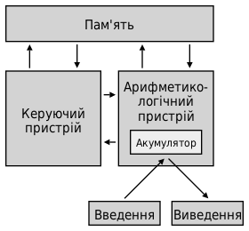
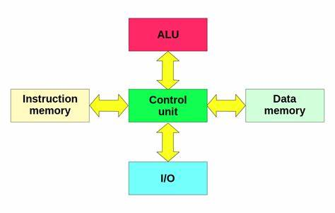

# Лекція №5 Мікроархітектура процесорів

**Вступ**

1. Визначення ключових термінів: мікроархітектура, макроархітектура, процесор.

**Класичні мікроархітектури**

1. Архітектура фон Неймана:
   - Опис та основні принципи.
   - Переваги та недоліки.
2. Гарвардська архітектура:
   - Розрізнення між кодом та даними.
   - Переваги в порівнянні з архітектурою фон Неймана.

**Сучасні мікроархітектури**

1. Архітектурні особливості та інновації Intel:
   - Tick-Tock модель розвитку.
   - Останні інновації та покращення.
2. AMD:
   - Zen архітектура: основні характеристики та покращення.
   - Вплив на ринок та конкуренцію.
3. ARM:
   - Особливості архітектури та широке застосування в мобільних пристроях.
   - Розширення в сфери серверів та настільних комп'ютерів.

4. Порівняння основних характеристик і підходів Intel, AMD, та ARM.

### Визначення ключових термінів: мікроархітектура, макроархітектура, процесор

**Мікроархітектура** — це набір проектних рішень, які визначають, як конкретний процесор виконує інструкції ISA (набір інструкцій процесора). Іншими словами, мікроархітектура реалізує архітектуру процесора на апаратному рівні, визначаючи, як компоненти процесора, такі як блоки ALU (арифметично-логічний блок), регістри, кеш-пам'ять і шини даних взаємодіють для виконання інструкцій. Мікроархітектура включає такі аспекти, як швидкість годинника, кількість ядер, оптимізацію енергоспоживання, та розмір кеш-пам'яті. Вона безпосередньо впливає на продуктивність і енергоефективність процесора.

**Макроархітектура** відноситься до архітектурного рівня вище мікроархітектури та описує загальні принципи та структуру системи. У контексті комп'ютерних систем, макроархітектура може описувати організацію всієї обчислювальної системи, включаючи процесор, пам'ять, вхід/вихід та зв'язок між ними. Макроархітектура задає вищий рівень дизайну, який охоплює вибір технологій, схеми взаємодії компонентів і загальну структуру системи, але не вдається в деталі реалізації окремих компонентів, які належать до сфери мікроархітектури.

**Процесор** (центральний процесор, CPU) є головним компонентом комп'ютера, відповідальним за виконання програмного коду і обробку даних. Процесор виконує інструкції програм, керує потоком даних між різними компонентами системи та здійснює арифметичні та логічні операції. Сучасні процесори можуть мати кілька обчислювальних ядер, кожне з яких може обробляти інструкції незалежно, значно підвищуючи загальну продуктивність системи.

Розуміння цих трьох ключових термінів є важливим для глибшого осягнення архітектурних принципів та проектних рішень, що лежать в основі сучасних обчислювальних систем. Мікроархітектура та макроархітектура взаємопов'язані, але кожна з них розглядає систему з різних точок зору — від детальної реалізації на рівні апаратного забезпечення до загальної структури та взаємодії компонентів на вищому рівні.

### Архітектура фон Неймана

#### Опис та основні принципи

Архітектура фон Неймана, названа на честь математика та фізика Джона фон Неймана, який опублікував цю концепцію у 1945 році, є фундаментальною організаційною структурою для більшості сучасних комп'ютерів. Ця архітектура включає кілька ключових принципів:

1. **Єдина пам'ять**: Код програми та дані зберігаються в одній і тій же пам'яті. Це дозволяє програмам змінювати себе під час виконання, що є основою для технік програмування, таких як цикли та умовні інструкції.
2. **Послідовне виконання інструкцій**: Комп'ютер виконує інструкції послідовно, одну за одною, хоча сучасні технології дозволяють деякі форми паралелізму на рівні інструкцій.
3. **Змінність програм**: Здатність змінювати виконання програми шляхом зміни інструкцій, що зберігаються в пам'яті, без необхідності модифікації самої апаратної частини.

#### Переваги

1. **Спрощення дизайну та розробки**: Однаковий підхід до зберігання даних і інструкцій спрощує архітектуру комп'ютера та робить процес програмування більш зрозумілим.
2. **Гнучкість програмування**: Здатність комп'ютера виконувати програму, яка може змінювати себе під час виконання, надає велику гнучкість у розробці програмного забезпечення.
3. **Універсальність**: Архітектура фон Неймана може бути використана для будь-якого типу обчислень, що робить її універсальною базою для розробки різноманітних обчислювальних систем.

#### Недоліки

1. **Проблема вузького горловища фон Неймана**: Оскільки інструкції та дані ділять одну шину для передачі даних до процесора, це може призвести до затримок, оскільки процесор часто чекає на доступ до інструкцій або даних. Це обмежує швидкість виконання програм.
2. **Обмежена швидкість**: Через послідовне виконання інструкцій, сучасні методи оптимізації, такі як виконання команд поза порядком або паралельне виконання інструкцій, вимагають складних обходних шляхів навколо базових обмежень архітектури фон Неймана.
3. **Вразливість до атак**: Спільне використання пам'яті для коду та даних може підвищити вразливість системи до певних типів атак, таких як виконання коду через переповнення буфера.

Незважаючи на ці недоліки, архітектура фон Неймана залишається фундаментальною для розробки і розуміння сучасних обчислювальних систем, і багато її принципів застосовуються в найсучасніших архітектурах.

###  Гарвардська архітектура

#### Розрізнення між кодом та даними

Гарвардська архітектура — це архітектура комп'ютера, в якій фізично відокремлені сховища та шини використовуються для зберігання інструкцій (коду програм) та даних. Це означає, що процесор може одночасно зчитувати інструкції та доступатися до даних, не конкуруючи за доступ до однієї і тієї ж пам'яті або шини. Основна ідея полягає в тому, щоб збільшити швидкість обчислень за рахунок паралельної обробки інструкцій та даних.

#### Переваги в порівнянні з архітектурою фон Неймана

1. **Збільшення пропускної здатності**: Оскільки інструкції та дані зберігаються окремо, процесор може одночасно зчитувати інструкції та доступатися до даних, що зменшує затримку та збільшує пропускну здатність системи.
2. **Покращена безпека**: Розділення пам'яті для даних та коду може підвищити безпеку, ускладнюючи атаки, які намагаються виконати ненадійний код через механізми, такі як переповнення буфера.
3. **Оптимізація пам'яті**: Можливість оптимізувати окремі блоки пам'яті під конкретні типи даних або інструкцій. Наприклад, пам'ять для інструкцій може бути оптимізована для швидкого послідовного читання, тоді як пам'ять для даних може бути оптимізована для частого читання та запису.
4. **Ефективність використання кешу**: Окремі кеші для даних та інструкцій дозволяють оптимізувати використання кеш-пам'яті, зменшуючи конфлікти та промахи кешу.

Незважаючи на ці переваги, гарвардська архітектура також має свої недоліки, зокрема складність та вартість реалізації через необхідність використання додаткових шин та пам'яті. Проте, вона знаходить широке застосування у вбудованих системах та цифровій обробці сигналів, де висока пропускна здатність та ефективність обробки є критично важливими.

Гарвардська архітектура, з її основною ідеєю розділення сховищ для коду програм і даних, була розроблена для оптимізації швидкості обробки інформації в комп'ютерах. Це розділення дозволяє виконувати операції зчитування даних і коду інструкцій одночасно, що робить обчислювальний процес ефективнішим порівняно з архітектурою фон Неймана, де доводиться чекати завершення доступу до пам'яті, перш ніж можна виконати наступний крок.

### Технічні аспекти

У гарвардській архітектурі, завдяки окремим шинам для коду програми та даних, можливе одночасне зчитування інструкцій та даних, що мінімізує затримки. Це особливо важливо в високопродуктивних обчислювальних системах та системах реального часу, де критично важливою є швидкість відгуку.

Крім того, розділення пам'яті дозволяє оптимізувати її під конкретні задачі. Наприклад, пам'ять для коду програм може бути реалізована як ROM (Постійна пам'ять), оскільки програмний код зазвичай не змінюється під час виконання. З іншого боку, пам'ять для даних зазвичай реалізується як RAM (Оперативна пам'ять), що дозволяє швидко записувати та зчитувати інформацію.

### Приклади застосування

Гарвардська архітектура широко використовується в мікроконтролерах та спеціалізованих процесорах, таких як DSP (Цифрові сигнальні процесори). У цих областях важлива висока швидкість обробки сигналів та ефективне виконання коду, що стає можливим завдяки паралельному доступу до інструкцій та даних.

### Недоліки

Попри численні переваги, гарвардська архітектура має і недоліки. Одним з основних є складність і вартість реалізації. Додаткові шини для підтримки окремих каналів доступу до пам'яті для даних та коду збільшують фізичний розмір процесора та його вартість. Також, програмування та управління пам'яттю можуть бути складнішими через необхідність враховувати розділення пам'яті.

### Заключення

Незважаючи на деякі обмеження, гарвардська архітектура продовжує залишатися важливою у світі комп'ютерних технологій, особливо в аплікаціях, що вимагають високої швидкості обробки та ефективності. Розуміння особливостей та переваг цієї архітектури є ключовим для інженерів та розробників, які прагнуть оптимізувати продуктивність своїх систем.

### Сучасні мікроархітектури: Архітектурні особливості процесорів Intel

#### Tick-Tock модель розвитку

Компанія Intel довгий час використовувала модель розвитку, відому як "Tick-Tock", щоб планувати випуск своїх процесорів. Модель складалася з двох основних етапів:

- **Tick**: Етап "Tick" означав впровадження нового виробничого процесу з меншим розміром транзисторів, що дозволяло збільшити кількість транзисторів на чіпі без збільшення його розміру. Це, в свою чергу, забезпечувало покращення продуктивності та енергоефективності.
- **Tock**: На етапі "Tock" Intel представляла нову мікроархітектуру, що використовувала існуючий виробничий процес. Це дозволяло значно покращити продуктивність і функціональні можливості процесорів за рахунок оптимізації самої архітектури.

Ця модель дозволяла компанії регулярно оновлювати свої продукти, чергуючи між покращенням технологічного процесу та архітектурних нововведень, забезпечуючи таким чином стабільне зростання продуктивності.

#### Останні інновації та покращення

У останні роки Intel почала відходити від чіткого слідування моделі "Tick-Tock" через складнощі з дальшим зменшенням розміру транзисторів та переходом до більш складних схем розвитку продуктів. Однак компанія продовжує впроваджувати значні інновації у своїх процесорах:

- **Оптимізація виробничих процесів**: Незважаючи на уповільнення темпів переходу на менші норми техпроцесу, Intel продовжує вдосконалювати свої технології виробництва, включаючи введення нових матеріалів і технік літографії.
- **Покращення архітектури**: Intel активно розробляє нові архітектури, які забезпечують покращення продуктивності, зниження споживаної потужності та підтримку нових технологій, таких як штучний інтелект і машинне навчання.
- **Інтеграція додаткових функцій**: Сучасні процесори Intel інтегрують все більше функцій безпосередньо на чіп, включаючи графічні процесори, системи управління енергоспоживанням та засоби шифрування даних.

- **Збільшення кількості ядер**: Щоб підвищити загальну продуктивність, Intel збільшує кількість обчислювальних ядер у своїх процесорах, що дозволяє ефективніше обробляти паралельні потоки даних.

Ці інновації та покращення дозволяють Intel зберігати лідируючі позиції на ринку процесорів, а також адаптуватися до постійно зростаючих вимог до продуктивності, енергоефективності та функціональності сучасного програмного забезпечення.

Сучасні мікроархітектури Intel постійно розвиваються, пропонуючи покращення в продуктивності, енергоефективності та функціональності. Intel здійснює це через інноваційні технології та дизайн мікроархітектури, що дозволяє компанії зберігати лідерство на ринку мікропроцесорів. Нижче наведено кілька ключових архітектурних особливостей, які характеризують сучасні процесори Intel.

### Гетерогенне ядерне дизайн

Intel впроваджує гетерогенний дизайн ядер в своїх новітніх мікроархітектурах, наприклад, використовуючи комбінацію високопродуктивних та енергоефективних ядер в одному чипі. Цей підхід дозволяє оптимізувати споживання енергії та продуктивність в залежності від навантаження, покращуючи загальну ефективність процесора.

### Технологія 10nm та 7nm виробництва

Intel поступово переходить до більш дрібних техпроцесів, таких як 10nm і навіть 7nm, що дозволяє розміщувати більше транзисторів на одиницю площі, збільшуючи продуктивність та знижуючи енергоспоживання. Ці інновації в техпроцесі також ведуть до покращення показників енергоефективності та зменшення тепловиділення.

### Оптимізація кеш-пам'яті

Intel постійно оптимізує кеш-пам'ять у своїх процесорах, покращуючи ієрархію кешу для зменшення затримок і збільшення швидкості доступу до даних. Розширення кеш-пам'яті та вдосконалення алгоритмів управління кешем сприяють зростанню загальної продуктивності системи.

### Технології Hyper-Threading

Hyper-Threading — технологія Intel, яка дозволяє кожному фізичному ядру процесора обробляти два потоки інструкцій одночасно, значно підвищуючи продуктивність при виконанні багатопоточних задач. Це забезпечує краще використання ресурсів процесора, покращуючи загальну продуктивність при виконанні складних обчислювальних завдань.

### Технології вбудованої графіки

Сучасні процесори Intel включають потужні вбудовані графічні адаптери, що забезпечують високу продуктивність графічних операцій без необхідності використання окремих графічних карт. Це особливо корисно для портативних пристроїв, де обмежені розміри та енергоспоживання.

### Оптимізація для штучного інтелекту

Intel активно розвиває технології та інструкції, оптимізовані для завдань штучного інтелекту та глибокого навчання. Це включає спеціалізовані інструкції та апаратні прискорювачі, які підвищують продуктивність при роботі з нейронними мережами та іншими алгоритмами штучного інтелекту.

### Заключення

Сучасні мікроархітектури Intel продемонстрували значний прогрес у покращенні продуктивності, енергоефективності та функціональності процесорів. Завдяки інноваціям у дизайні, техпроцесі виробництва та оптимізації апаратного забезпечення, Intel продовжує встановлювати стандарти для майбутнього розвитку обчислювальних технологій.

### Сучасні мікроархітектури: Архітектурні особливості процесорів AMD

Сучасні мікроархітектури процесорів AMD характеризуються вражаючими досягненнями в продуктивності, енергоефективності та інноваційному дизайні. Основним рушієм прогресу в останні роки стала архітектура Zen, яка продовжує еволюціонувати від Zen до Zen 3 і планується Zen 4. Кожне нове покоління приносить значні покращення в швидкодії та ефективності, закладаючи основу для сучасних настільних, серверних та мобільних процесорів AMD. Нижче представлено декілька ключових архітектурних особливостей процесорів AMD.

### Модульний дизайн

AMD використовує унікальний модульний підхід до дизайну своїх процесорів, відомий як "чиплети". Чиплети містять ядра обробки, тоді як інші елементи, такі як контролери пам'яті та вводу-виводу, можуть бути винесені в окремий кристал, що покращує ефективність та дозволяє легше масштабувати процесори.

### Збільшення кількості ядер

Завдяки модульному дизайну та оптимізації мікроархітектури, AMD змогла значно збільшити кількість ядер у своїх процесорах, забезпечуючи високу продуктивність при виконанні багатопоточних завдань. Це особливо важливо для серверних та настільних систем високого класу, де кількість ядер безпосередньо впливає на здатність обробляти великі обсяги даних або одночасно виконувати кілька процесів.

### Покращення енергоефективності

Кожне нове покоління архітектури Zen приносить покращення в енергоефективності, завдяки оптимізації дизайну ядра та переходу на більш дрібні виробничі процеси. Наприклад, Zen 3 використовує 7nm техпроцес, що дозволяє зменшити енергоспоживання при збереженні високої продуктивності.

### Покращена архітектура кешу

AMD значно покращила архітектуру кешу в своїх сучасних процесорах, збільшивши обсяг кешу третього рівня (L3), що покращує загальну швидкість виконання програм, зменшуючи затримки доступу до пам'яті та збільшуючи швидкість передачі даних.

### Підтримка високошвидкісної пам'яті

Сучасні процесори AMD підтримують високошвидкісну пам'ять DDR4 та новіші стандарти, такі як DDR5, забезпечуючи кращу пропускну здатність та зниження затримок, що особливо важливо для ігрових та професійних застосунків.

### Інтеграція з графікою та ШІ

AMD також інтегрує в свої процесори потужні графічні рішення та спеціалізовані блоки для обробки завдань штучного інтелекту, забезпечуючи високу продуктивність не тільки в традиційних обчисленнях, але і в графічних та ШІ-застосунках.

### Заключення

Мікроархітектура AMD продовжує еволюціонувати, пропонуючи революційні покращення у швидкодії, енергоефективності та інноваційності. Завдяки унікальним архітектурним рішенням та постійному стремлінню до інновацій, AMD утримує конкурентні позиції на ринку процесорів, пропонуючи високопродуктивні рішення для широкого спектру застосунків.

### Сучасні мікроархітектури: Архітектурні особливості процесорів ARM

Сучасні мікроархітектури процесорів ARM відрізняються унікальною комбінацією високої енергоефективності, продуктивності та компактності. ARM Holdings розробляє архітектури, які широко використовуються в мобільних пристроях, вбудованих системах, а в останні роки активно застосовуються в серверах та навіть настільних комп'ютерах. Основні архітектурні особливості процесорів ARM включають:

### RISC-архітектура

ARM використовує RISC (Reduced Instruction Set Computing) архітектуру, яка спрощує інструкції процесора, дозволяючи виконувати операції швидше та ефективніше за енергоспоживанням. Цей підхід забезпечує високу продуктивність при низькому споживанні енергії, що робить процесори ARM ідеальними для мобільних пристроїв та інших застосунків, де важлива енергоефективність.

### Big.LITTLE технологія

Big.LITTLE — це інноваційна технологія, розроблена ARM, яка дозволяє об'єднувати "великі" високопродуктивні ядра з "маленькими" енергоефективними ядрами в одному чипі. Це дозволяє динамічно розподіляти навантаження в залежності від поточних вимог до продуктивності та енергоспоживання, підвищуючи загальну ефективність системи.

### Гнучкість ліцензування

ARM пропонує гнучку модель ліцензування, яка дозволяє партнерам адаптувати архітектуру під конкретні потреби їхніх продуктів. Це означає, що виробники можуть розробляти власні унікальні рішення на базі архітектури ARM, що призводить до широкого розмаїття чипів, оптимізованих для різних застосунків.

### Застосування у різних сегментах ринку

Хоча процесори ARM традиційно асоціюються з мобільними пристроями, їх застосування значно розширилося. Сучасні мікроархітектури ARM використовуються в широкому спектрі продуктів, включаючи сервери, настільні комп'ютери, ноутбуки, автомобільні системи та інтернет речей (IoT).

### Підтримка машинного навчання та ШІ

ARM активно розробляє технології та інструкції, оптимізовані для завдань машинного навчання та штучного інтелекту. Це включає в себе спеціалізовані апаратні блоки та оптимізації на рівні мікроархітектури для прискорення обчислень, пов'язаних з ШІ.

### Перехід на новітні техпроцеси

ARM активно співпрацює з виробниками напівпровідників для впровадження новітніх технологій виробництва, таких як 7nm і 5nm техпроцеси. Це дозволяє створювати ще більш енергоефективні та продуктивні процесори.

### Заключення

Архітектура ARM продовжує впливати на широкий спектр обчислювальних пристроїв, пропонуючи високу енергоефективність, продуктивність та адаптабельність. Завдяки неперервним інноваціям та стратегічному позиціонуванню на ринку, ARM зміцнює свої позиції як ключовий гравець у сфері мікропроцесорних технологій, відкриваючи нові можливості в мобільних технологіях, обчислювальних системах високої продуктивності та інтернеті речей.
Порівняння основних характеристик і підходів Intel, AMD, та ARM відображає їх унікальні стратегії та сильні сторони в області розробки та впровадження мікропроцесорних технологій. Кожна з цих компаній має свої фокусні області, які визначають їх продукти та впливають на ринок. Нижче наведено порівняння за ключовими параметрами:

### Архітектурний підхід

- **Intel**: Використовує власні мікроархітектури, які регулярно оновлюються для покращення продуктивності та енергоефективності. Intel зосереджений на високопродуктивних комп'ютерних системах, включаючи настільні ПК, ноутбуки та сервери. Головна увага приділяється інноваціям у виробництві чипів та оптимізації процесорів.
- **AMD**: Також розробляє власні мікроархітектури, зокрема сімейство Zen, яке забезпечує конкурентоспроможну продуктивність при нижчому енергоспоживанні. AMD успішно конкурує з Intel у сегментах настільних, серверних та ігрових систем, пропонуючи високу продуктивність за оптимальну ціну.
- **ARM**: Розробляє архітектуру, на основі якої створюють чіпи різні виробники. ARM зосереджується на енергоефективності та широкому застосуванні в мобільних пристроях, вбудованих системах та, в останні роки, у серверах і ноутбуках. Підхід ARM дозволяє гнучко налаштовувати чіпи під конкретні потреби виробників.

### Продуктивність та енергоефективність

- **Intel** та **AMD** обидва прагнуть досягти високої продуктивності при оптимізації енергоспоживання, але Intel традиційно зосереджений на максимізації продуктивності для корпоративного сегмента та робочих станцій, в той час як AMD надає перевагу співвідношенню продуктивності до ціни, що робить їх продукти дуже привабливими для ігрових систем і споживчого ринку.
- **ARM** вирізняється високою енергоефективністю, що робить їх архітектуру ідеальною для мобільних пристроїв та інших застосунків, де важлива економія енергії.

### Інновації та ринкова стратегія

- **Intel** інвестує значні ресурси в дослідження та розробку, зокрема у вдосконалення виробничих процесів. Їхні найсучасніші технології виробництва дозволяють зменшити розмір транзисторів та підвищити енергоефективність.
- **AMD** акцентує на оптимізації архітектури та ефективності співвідношення ціни до продуктивності, використовуючи інноваційні підходи, такі як модульний дизайн та збільшення кількості ядер.
- **ARM** підтримує широку екосистему партнерів та виробників, що дозволяє швидко адаптувати технології до змін на ринку та вимог споживачів, що забезпечує їх широке поширення в різних сегментах.

### Заключення

Хоча Intel і AMD конкурують у схожих сегментах ринку, намагаючись досягти високої продуктивності та ефективності для настільних та серверних систем, ARM займає унікальну нішу, пропонуючи високу енергоефективність і широку адаптабельність своїх архітектур для мобільних пристроїв, IoT та інших вбудованих застосунків. Кожна з цих архітектур має свої переваги та оптимальні сценарії використання, відіграючи ключову роль у формуванні сучасного ландшафту обчислювальних технологій.