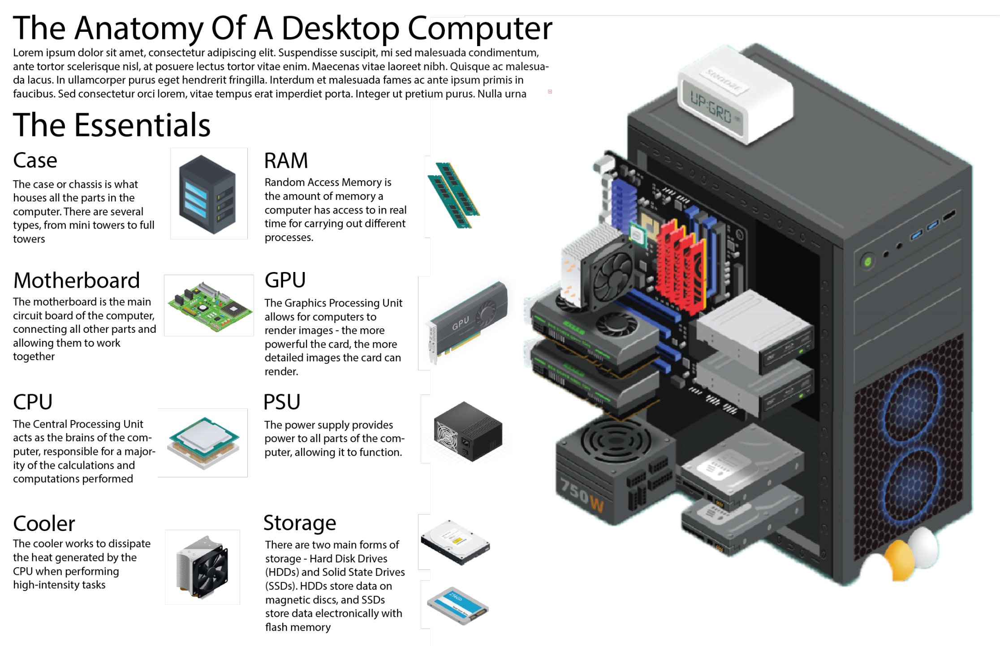

### Лабораторна робота №1: Вступ до архітектури комп'ютерів

**Мета роботи**: Ознайомитися з основними компонентами архітектури комп'ютера та їх функціями. Розвинути навички аналізу апаратного забезпечення комп'ютера.

### Підготовка до виконання роботи

Перед початком роботи вам знадобиться доступ до комп'ютера (фізичного або віртуального) для аналізу його компонентів.

### Оформлення протоколу

Протокол лабораторної роботи необхідно оформити у вигляді документу, який містить наступні розділи:

1. **Титульний аркуш** - вказується назва установи, факультету, кафедри, назва дисципліни, тема роботи, прізвище та ініціали студента, дата виконання.
2. **Мета роботи** - коротко формулюється мета.
3. **Завдання** - текст завдання з детальним описом виконаних дій та аналізом отриманих результатів.
6. **Висновки** - підсумки виконаної роботи, оцінка отриманого досвіду та можливого застосування знань.

## Завдання. Компоненти сучасного ПК:

1. Оберіть для дослідження або опису:
   - Ваш особистий комп'ютер.
   - Комп'ютер вашої мрії (задайте параметри комп'ютера, який би ви хотіли мати).
2. Опишіть основні компоненти обраного комп'ютера, включаючи:
   - **Процесор (ЦП)**: модель, кількість ядер, тактову частоту.
   - **Оперативна пам'ять (ОЗП)**: тип, об'єм, тактова частота.
   - **Системна плата (материнська плата)**: чіпсет, підтримка пам'яті, роз'єми для розширення.
   - **Накопичувачі**: типи накопичувачів (HDD, SSD), їх об'єм.
   - **Відеокарта**: інтегрована або дискретна, модель, об'єм пам'яті.
   - **Блок живлення**: потужність, сертифікація ефективності.
   - **Корпус**: тип, особливості дизайну та охолодження.
   - **Пристрої вводу-виводу** (клавіатура,  миша, монітор, принтер тощо)
3. Для кожного компонента вкажіть його призначення та як він взаємодіє з іншими компонентами системи.
4. Розгляньте, як обрана конфігурація впливає на загальну продуктивність комп'ютера. Обговоріть, для яких завдань (ігри, робота з графікою, програмування тощо) цей комп'ютер буде найбільш ефективним.

