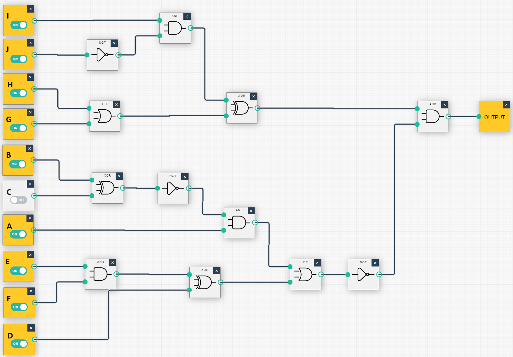

### Лабораторна Робота №3: Гейти та Регістри

---

**Мета**: Ознайомлення з основними логічними гейтами та регістрами, що використовуються в цифровій електроніці та комп'ютерній архітектурі. Розробка та аналіз логічних схем з використанням цих елементів.

**Завдання**:
1. Описати призначення та принцип роботи обраної логічної схеми.
2. Складіть обрану схему у веб застосунку: [Logic Gate Simulator | Academo.org - Free, interactive, education.](https://academo.org/demos/logic-gate-simulator/)
3. Скласти таблицю істинності для логічної схеми.
4. Проаналізувати отримані результати.

**Варіанти Завдань**:

Змінимо вказані варіанти так, щоб кожен складався з трьох логічних елементів.

### Приклад

- **Формула**:
  $$
  Q = \overline{((A \land \overline{B \oplus C}) \lor (D \oplus (E \land F)))} \land ((G \lor H) \oplus (I \land \overline{J}))
  $$

- **Опис**: Ця складна логічна схема включає в себе комбінацію різних логічних гейтів для обробки входів A-J. Вона починається з XOR між B та C, результат якого інвертується та потім входить в AND разом з A. Тим часом, E та F об'єднуються через AND, результат подається на XOR разом з D. Обидва ці результати об'єднуються через OR, який потім інвертується. З іншого боку, G та H об'єднуються через OR, I та інвертований J через AND, і ці два результати об'єднуються через XOR. Кінцеві результати обох частин об'єднуються через AND, щоб сформувати вихід Q.

|  D   |  F   |  E   |  A   |  C   |  B   |  G   |  H   |  J   |  I   |  Q   |
| :--: | :--: | :--: | :--: | :--: | :--: | :--: | :--: | :--: | :--: | :--: |
|  ..  |  ..  |  ..  |  ..  |  ..  |  ..  |  ..  |  ..  |  ..  |  ..  |  ..  |
|  1   |  1   |  1   |  1   |  0   |  1   |  1   |  1   |  1   |  1   |  1   |
|  1   |  1   |  1   |  0   |  0   |  1   |  1   |  1   |  1   |  1   |  1   |
|  1   |  1   |  0   |  0   |  0   |  1   |  1   |  1   |  1   |  1   |  0   |
|  1   |  0   |  1   |  0   |  0   |  1   |  1   |  1   |  1   |  1   |  0   |
|  0   |  1   |  1   |  0   |  0   |  1   |  1   |  1   |  1   |  1   |  0   |
|  ..  |  ..  |  ..  |  ..  |  ..  |  ..  |  ..  |  ..  |  ..  |  ..  |  ..  |

**На додатковий бал (він 1 до 3 балів). Створіть та опишіть у вигляді формули власну складну схему.**

### Варіант 1

- **Формула**: 
  $$
  Q = (A \land B) \land C
  $$
  
- **Опис**: Схема з двох логічних гейтів AND, де другий AND отримує на входи вихід першого AND та додатковий сигнал C.

### Варіант 2

- **Формула**: 
  $$
  Q = A \land (\overline{B \oplus C})
  $$

- **Опис**: Схема складається з логічного гейта XOR, виходи якого подаються на гейт NOT, і вихід NOT гейта з'єднується з входом A через AND гейт.

### Варіант 3

- **Формула**: 
  $$
  Q = (A \oplus B) \oplus C
  $$
  
- **Опис**: Схема з двох логічних гейтів XOR, де другий XOR отримує на один з входів вихід першого XOR та додатковий сигнал C.

### Варіант 4

- **Формула**: 
  $$
  Q = ((A \land B) \lor C) \land D
  $$
  
- **Опис**: Схема з двох логічних гейтів AND та одного OR, де вихід OR гейта є входом для другого AND разом з додатковим сигналом D.

### Варіант 5

- **Формула**: 
  $$
  Q = \overline{(A \land B) \lor C}
  $$
  
- **Опис**: Схема з логічних гейтів AND та OR, на виходи якого подається гейт NOT.

### Варіант 6

- **Формула**: 
  $$
  Q = ((A \lor B) \land C) \lor D
  $$
  
- **Опис**: Схема з логічних гейтів OR, AND та OR, де вихід першого AND є входом для другого OR разом з додатковим сигналом D.

### Варіант 7

- **Формула**: 
  $$
  Q = ((A \oplus B) \land C) \lor D
  $$
  
- **Опис**: Схема з двох логічних гейтів XOR, одного AND та OR, де вихід AND гейта є входом для OR разом з додатковим сигналом D.

### Варіант 8

- **Формула**: 
  $$
  Q = \overline{A \lor (B \land C)}
  $$
  
- **Опис**: Схема з логічного гейта OR, на виходи якого подається гейт AND, а потім гейт NOT.

### Варіант 9

- **Формула**:
  $$
  Q = \overline{(A \land B) \lor (C \land D)}
  $$
  
- **Опис**: Схема, що складається з двох логічних гейтів AND, виходи яких з'єднані з входами одного OR, та вихід OR з'єднаний з NOT.

### Варіант 10
- **Формула**: 
  $$
  Q = (\overline{A \land B} \oplus C) \land D
  $$
- **Опис**: Схема складається з NAND гейта, виходи якого подаються на XOR гейт разом з третім входом C, і результат XOR гейта з'єднується з четвертим входом D через AND гейт.
